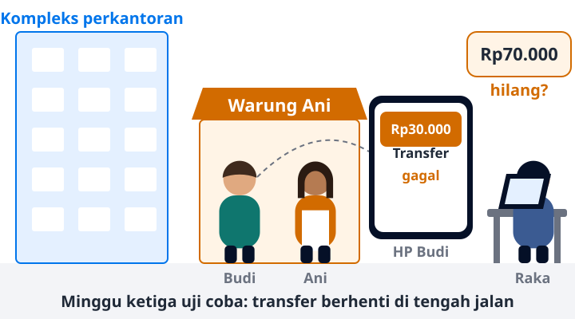

# Tahap 1 · MVP untuk 100 penguji

Baca 4 menit · Halaman tahap · Jalur inti
{: .meta }

## Inti

Rekeningo diuji oleh 100 orang di satu kompleks perkantoran. Raka membangun satu backend monolith dengan satu database. Masalah terbesar di tahap ini adalah kebenaran data, bukan beban server.

## Ceritanya

<figure class="bb-ilus" markdown>

<figcaption>Adegan yang menutup Tahap 1. Tiga halaman pertama menyiapkanmu untuk memahaminya.</figcaption>
</figure>

Sinta ingin menguji Rekeningo di satu kompleks perkantoran. Raka punya enam minggu.

Pertanyaan pertama Raka: cukup pakai Supabase atau Firebase, atau perlu backend sendiri? Transfer saldo mengubah dua saldo sekaligus. Aturan bisnisnya juga tidak boleh dipegang app di HP, karena app bisa dimodifikasi. Jadi Raka memilih satu backend monolith dengan satu PostgreSQL.

Enam minggu terasa cukup. Lalu di minggu ketiga, satu transfer gagal di tengah jalan, dan saldo seorang penguji hilang.

## Angka di tahap ini

Semua angka adalah asumsi cerita. Ganti angkanya kalau mau menghitung untuk aplikasimu sendiri.

| Besaran | Nilai | Cara hitung |
|---|---|---|
| User terdaftar | 100 | asumsi |
| User aktif harian (DAU) | 30 | 100 × 30% (asumsi) |
| Request per hari | 1.200 | 30 × 40 request (asumsi) |
| Puncak request per detik | ±0,14 | 1.200 ÷ 86.400 × 10 (faktor jam makan siang, asumsi) |
| Data transaksi per tahun | ±6,6 MB | 30 × 2 transaksi × 365 × 300 B (asumsi) |

Artinya, di jam paling sibuk hanya ada satu request per tujuh detik. Server mana pun sanggup. Yang bisa salah adalah datanya.

## Masalah yang muncul

Urutan di tabel ini adalah urutan cerita dan urutan baca.

<!-- daftar-tahap -->
| Masalah | Halaman |
|---|---|
| Bingung apa saja yang harus ditulis di backend | [1.1 Apa yang dikerjakan backend](../a-gambaran/a1-apa-yang-dikerjakan-backend.md) |
| Ragu: cukup Supabase/Firebase atau perlu backend sendiri? | [1.2 BaaS atau backend sendiri](../a-gambaran/a4-baas-vs-backend-sendiri.md) |
| Tidak tahu apa yang terjadi setelah app mengirim request | [1.3 Perjalanan satu request](../a-gambaran/a2-perjalanan-request.md) |
| Bingung memilih method dan status code | [1.4 HTTP: method, status, header](../b-fondasi/b1-1-http.md) |
| App menampilkan pesan error yang tidak jelas | [1.5 Resource dan format error](../b-fondasi/b1-2-resource-error.md) |
| Nominal transfer negatif lolos ke database | [1.6 Validation dan error handling](../b-fondasi/b6-validation-error.md) |
| App dan backend beda paham soal bentuk JSON | [1.7 Kontrak API dengan OpenAPI](../b-fondasi/b1-4-openapi.md) |
| Bingung merancang tabel akun, transaksi, pesanan | [1.8 Data modeling dan relasi](../b-fondasi/b2-1-data-modeling.md) |
| Tergoda pindah ke NoSQL "karena lebih cepat" | [1.9 SQL atau NoSQL](../b-fondasi/b2-2-sql-vs-nosql.md) |
| Skema database di laptop dan di server berbeda | [1.10 Migration: skema sebagai kode](../b-fondasi/b4-1-migration.md) |
| Transfer gagal di tengah, saldo hilang | [1.11 Transaction](../b-fondasi/b3-1-transaction.md) |
| Bingung memilih session atau JWT untuk login | [1.12 Authentication: session atau token](../b-fondasi/b5-1-authentication.md) |
| Budi bisa melihat saldo Ani lewat ID di URL | [1.13 Authorization: siapa boleh apa](../b-fondasi/b5-3-authorization.md) |
| Logika transfer tercampur parsing HTTP | [1.14 Lapisan dasar](../b-fondasi/b7-1-lapisan-dasar.md) |
| Bug lama muncul lagi setelah perubahan | [1.15 Testing: apa dites di level mana](../c-operasional/c1-testing.md) |
| Deploy membuat app mati, atau harus mundur cepat | [1.16 Deployment dan rollback](../c-operasional/c3-deployment.md) |
| Tidak tahu harus mulai dari mana saat mendesain | [1.17 Kerangka berpikir dan estimasi](../d-system-design/d1-kerangka-berpikir.md) |
| Kode AI tidak sesuai maksud | [1.18 Menulis spesifikasi untuk AI](../f-ai-belajar/f1-spesifikasi-untuk-ai.md) |
| Ragu menyetujui kode atau desain buatan AI | [1.19 Review kode backend buatan AI](../f-ai-belajar/f2-review-kode-ai.md) |
<!-- /daftar-tahap -->

## Sengaja belum dilakukan

Keputusan "belum" sama pentingnya dengan keputusan "pakai".

- **Cache, queue, worker.** Belum ada masalah yang dijawabnya.
- **Microservice.** Satu developer tidak butuh batas antar-tim.
- **Load balancer dan beberapa server.** Downtime beberapa menit saat deploy masih bisa diterima untuk 100 penguji.
- **Kubernetes.** Biaya belajar dan operasionalnya jauh lebih besar dari manfaatnya.

Saat me-review rancangan buatan AI untuk aplikasi sebesar ini, salah satu komponen di atas muncul? Tanyakan masalah apa yang dijawabnya.

[[A1|Mulai: Apa yang dikerjakan backend →]]{ .md-button .md-button--primary }
