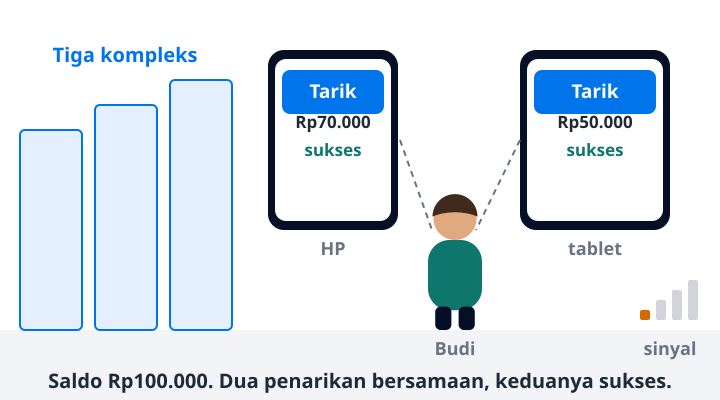

# Tahap 2 · Saldo salah dan dobel bayar

Baca 4 menit · Halaman tahap · Jalur inti
{: .meta }

## Inti

Rekeningo dibuka untuk tiga kompleks, sekitar 1.000 user. Bentuk arsitekturnya tetap sama. Masalah baru muncul karena dua request kini bisa terjadi bersamaan.

## Ceritanya

<figure class="bb-ilus" markdown>

<figcaption>Dua keluhan utama Tahap 2: penarikan ganda dan sinyal kantin yang lemah.</figcaption>
</figure>

Uji coba berhasil. Sinta membuka Rekeningo untuk tiga kompleks, dan tim backend bertambah jadi dua orang.

Tiga minggu kemudian, keluhan aneh mulai masuk:

- Budi menarik saldo dari HP dan tablet hampir bersamaan. Kedua penarikan sukses, padahal saldonya hanya cukup untuk satu.
- Di jam makan siang sinyal kantin lemah. App mengulang request bayar setelah timeout, dan Budi tertagih dua kali.
- Riwayat penjualan Ani mulai lambat. Penyebabnya bukan jumlah data, tapi satu query per pesanan untuk mengambil item.

Semua transfer sudah memakai transaction sejak Tahap 1. Jadi Raka sempat yakin datanya aman.

## Angka di tahap ini

| Besaran | Nilai | Cara hitung |
|---|---|---|
| User terdaftar | 1.000 | asumsi |
| User aktif harian (DAU) | 300 | 1.000 × 30% |
| Request per hari | 12.000 | 300 × 40 request |
| Puncak request per detik | ±1,4 | 12.000 ÷ 86.400 × 10 |
| Data transaksi per tahun | ±66 MB | 300 × 2 transaksi × 365 × 300 B |

Puncaknya masih di bawah dua request per detik. Tapi dua request yang menyentuh saldo yang sama, dalam milidetik yang sama, sudah cukup untuk membuat saldo salah.

## Masalah yang muncul

<!-- daftar-tahap -->
| Masalah | Halaman |
|---|---|
| Saldo salah: dua penarikan bersamaan sama-sama lolos | [2.1 Race condition dan lock](../b-fondasi/b3-2-race-condition-lock.md) |
| Transaction melihat data yang "berubah sendiri" | [2.2 Isolation level secara praktis](../b-fondasi/b3-3-isolation-level.md) |
| Dobel bayar setelah app retry | [2.3 Retry dan idempotency key dari app](../e-mobile/e3-retry-idempotency.md) |
| Riwayat panjang, halaman berikutnya berisi data ganda | [2.4 Pagination dan idempotent method](../b-fondasi/b1-3-pagination-idempotent.md) |
| Riwayat penjualan lambat walau datanya sedikit | [2.5 N+1 query](../b-fondasi/b2-4-n-plus-1.md) |
| Query lambat setelah data bertambah | [2.6 Index dan query plan](../b-fondasi/b2-3-index.md) |
| Response besar membebani HP dan kuota | [2.7 Ukuran payload dan kuota](../e-mobile/e5-ukuran-payload.md) |
| Rename kolom membuat app lama crash | [2.8 Ubah skema tanpa downtime](../b-fondasi/b4-2-ubah-skema-tanpa-downtime.md) |
| Perubahan API membuat app versi lama crash | [2.9 App versi lama yang tidak bisa dipaksa update](../e-mobile/e1-app-versi-lama.md) |
<!-- /daftar-tahap -->

## Sengaja belum dilakukan

- **Cache untuk riwayat.** Masalahnya N+1 dan index. Cache hanya menyembunyikan query yang buruk.
- **Pindah ke NoSQL "karena lebih cepat".** Data uang butuh transaction dan constraint.
- **Distributed lock (mis. Redis lock).** Satu database sudah menyediakan lock yang benar.

