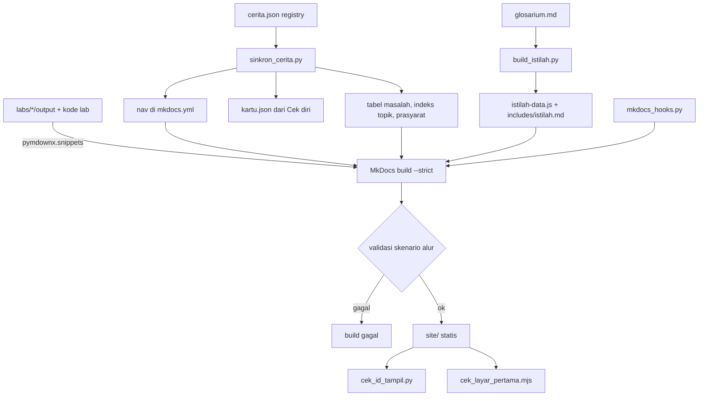

# Brief riset revisi total · Belajar Backend

Dokumen ini adalah potret lengkap project **Belajar Backend** per 2026-10-08 (commit `2a0596d`, branch `main`). Tujuannya: dibawa ke Claude chat sebagai bahan riset untuk merevisi project secara total, termasuk kemungkinan menambah tech stack.

Isi dokumen dibagi dua jenis:

- **Fakta**: apa yang ada di repo sekarang. Diambil dari kode, konfigurasi, data, dan catatan keputusan.
- **Pengamatan**: kelemahan atau celah yang terlihat saat membaca repo. Ditandai jelas di bagian 15. Ini bukan keputusan, hanya bahan diskusi.

---

## 0. Cara memakai dokumen ini di Claude chat

Tempel seluruh dokumen ini ke Claude chat, lalu awali dengan prompt seperti ini (boleh diubah):

```text
Saya pemilik project "Belajar Backend": situs panduan konsep backend berbahasa Indonesia
untuk mobile engineer, dibangun dengan MkDocs Material + widget JavaScript buatan sendiri
+ 26 lab yang merekam output asli (Go, PostgreSQL, Redis, Dart, Node, Python).

Dokumen di bawah menjelaskan seluruh project: tujuan, cerita, gaya bahasa, visualisasi,
arsitektur teknis, peran, alur interaksi pembaca, keputusan desain, dan kelemahan yang terlihat.

Saya ingin merevisi project ini secara total. Bantu saya riset:
1. Arsitektur situs dan tech stack baru yang layak (bandingkan beberapa opsi, dengan trade-off).
2. Perbaikan pengalaman belajar: visualisasi, interaksi, alur baca, progres pembaca.
3. Perbaikan konten dan gaya bahasa supaya benar-benar mudah dipahami.
4. Apa yang WAJIB dipertahankan (prinsip yang sudah terbukti baik) dan apa yang sebaiknya dibuang.
5. Rencana migrasi bertahap yang tidak merusak konten yang sudah ada.

Tanyakan dulu hal yang belum jelas sebelum memberi rekomendasi final.
Pisahkan fakta, asumsi, dan rekomendasi. Sertakan sumber untuk klaim tentang tools/library.
```

---

## 1. Ringkasan satu paragraf

**Belajar Backend** adalah situs panduan statis berbahasa Indonesia yang mengajarkan konsep backend lintas stack kepada **mobile engineer** (terutama Flutter). Panduan mengikuti satu aplikasi fiktif, **Rekeningo** (dompet digital + pemesanan dari toko kecil), yang tumbuh dalam **lima tahap** dari 100 user sampai sejuta user. Setiap masalah di cerita (saldo hilang, dobel bayar, lambat di jam sibuk, webhook ganda, database penuh) membawa pembaca ke satu konsep (transaction, lock, idempotency key, connection pool, queue, cache, outbox, replica). Ada **60 halaman**, **15 jenis widget interaktif** buatan sendiri (vanilla JS), dan **26 lab** yang bisa dijalankan. Lab itu menghasilkan **output asli** yang ditampilkan di halaman dengan label "Rekaman lab". Situs dibangun dengan **MkDocs 1.6.1 + Material for MkDocs 9.7.7**. Kualitas dijaga oleh satu skrip pemeriksaan (`tools/cek_batch.sh`): build strict, audit bahasa, 103 tes widget, dan cek "layar pertama" di empat ukuran layar lewat Chrome headless.

---

## 2. Tujuan, audiens, dan janji panduan

### Audiens

Mobile engineer yang ingin paham backend secara utuh, lintas stack. Sudut pandang pembaca diwakili tokoh **Raka**, mobile engineer Flutter yang kini juga memegang backend.

### Tiga kemampuan yang ditargetkan (dari `docs/index.md`)

1. Memahami konsep dan memilih opsi beserta trade-off-nya.
2. Menulis spesifikasi yang jelas, termasuk untuk AI.
3. Me-review kode backend buatan AI dan tahu apa yang harus dicek.

Targetnya **bukan** menghafal framework.

### Tiga pembeda yang dijanjikan (dari `README.md`)

| Pembeda | Wujudnya di project |
|---|---|
| **Konsep dulu, stack kemudian** | Contoh utama Go + PostgreSQL. Bagian "Di stack lain" membandingkan dengan Node/Express, Laravel, Django, Spring, Supabase/Firebase. |
| **Output asli, bukan karangan** | Status code, query plan, saldo akhir, dan urutan kejadian di halaman berasal dari lab yang direkam. Yang tidak direkam diberi label lain. |
| **Dari sudut pandang app** | Banyak halaman dimulai dari layar HP: apa yang dilihat user saat backend salah. Ada mockup HP di widget. |

### Penafian wajib

"Rekeningo dan seluruh ceritanya fiktif. Cerita ini tidak mengklaim kepatuhan terhadap regulasi pembayaran, perlindungan data, atau aturan lain yang berlaku di dunia nyata."

---

## 3. Cerita: Rekeningo dan lima tahap

### Aplikasinya

Rekeningo (fiktif) adalah aplikasi Flutter untuk menyimpan saldo, transfer ke sesama user, dan memesan dari toko kecil di sekitar (warung, apotek kecil, toko kelontong). Pembeli membayar dari saldo, lalu toko menyiapkan pesanan.

Nama "Rekeningo" dipilih setelah nama lain (Kantong, Kocek, Celengin, dll.) ternyata bentrok dengan aplikasi nyata. Pengecekan dilakukan di Google Play, App Store, pencarian web, dan domain.

Domain dompet digital dipilih karena transaction, race condition, idempotency, payment gateway, notifikasi, dan upload muncul secara alami.

### Tokoh

| Tokoh | Peran | Yang dibawanya ke cerita |
|---|---|---|
| **Raka** | Mobile engineer Flutter yang kini juga memegang backend | Sudut pandang pembaca. Setiap keputusan teknis dilihat dari mata Raka. |
| **Budi** | User. Top-up, transfer, pesan makan siang. | Bug yang terlihat user: saldo salah, dobel bayar, notifikasi terlambat. |
| **Ani** | Pemilik warung | Sisi toko: stok, pesanan masuk, riwayat penjualan, sinyal tidak stabil. |
| **Sinta** | Pemilik produk | Tuntutan bisnis: fitur baru, target pertumbuhan, kerja sama pihak ketiga. |

### Lima tahap

| Tahap | User | Masalah utama | Arsitektur sesudah tahap ini |
|---|---|---|---|
| 1 · MVP | 1–100 | Perlu backend sendiri atau BaaS? Transfer gagal di tengah, saldo hilang. Budi bisa melihat saldo Ani lewat ID di URL. | App Flutter → Monolith API → PostgreSQL (3 elemen) |
| 2 · Saldo salah dan dobel bayar | 100–1.000 | Dua penarikan bersamaan sama-sama lolos. App retry setelah timeout, Budi tertagih dua kali. Riwayat penjualan lambat (N+1). | Bentuk sama; isi berubah: idempotency key di app, cek baris berubah di API, index + lock di DB |
| 3 · Lambat di jam sibuk | 1.000–10.000 | Endpoint bayar memanggil API notifikasi di dalam transaction, pool habis. Stok Ani hilang saat offline. Brute force login. | App → Monolith (2 instance) → PostgreSQL + Redis (cache + queue) → Worker → FCM/email |
| 4 · Integrasi pihak ketiga | 10.000–100.000 | Payment gateway lambat. Webhook dikirim dua kali. Layanan verifikasi identitas hanya menerima IP terdaftar. Dua tim bentrok di satu codebase. | Monolith modular + endpoint BFF, satu service pembayaran yang dipecah, object storage, proxy |
| 5 · Satu database tidak cukup | 100.000–1.000.000+ | Database utama penuh oleh query baca. Laporan merchant mengganggu transaksi. Notifikasi ke ratusan ribu user. Biaya cloud naik. | Load balancer → API + beberapa service → DB primary + read replica, queue |

Setiap halaman tahap punya bagian **"Sengaja belum dilakukan"**. Contoh: Tahap 2 sengaja tidak memakai cache, karena masalahnya N+1 dan index, dan cache hanya akan menyembunyikan query yang buruk. Ini cara panduan mengajarkan bahwa menambah komponen selalu punya biaya.

### Angka asumsi beban

Semua angka beban adalah **asumsi cerita** dan rumusnya selalu ditulis, supaya pembaca bisa mengganti angkanya:

```text
DAU               = user terdaftar × rasio aktif harian
request per hari  = DAU × request per user aktif per hari
rata-rata RPS     = request per hari ÷ 86.400 detik
puncak RPS        = rata-rata RPS × faktor puncak
data per tahun    = transaksi per hari × 365 × ukuran per baris
```

| Parameter | T1 | T2 | T3 | T4 | T5 |
|---|---|---|---|---|---|
| User terdaftar | 100 | 1.000 | 10.000 | 100.000 | 1.000.000 |
| Rasio aktif harian | 30% | 30% | 25% | 20% | 20% |
| Request per user aktif per hari | 40 | 40 | 60 | 60 | 60 |
| Faktor puncak | 10× | 10× | 10× | 10× | 10× |
| Puncak RPS (hasil) | ±0,14 | ±1,4 | ±17 | ±140 | ±1.400 |

Pelajaran yang ingin ditanamkan: **puncak RPS di Tahap 1–3 kecil**. Masalah awal hampir selalu soal kebenaran data dan query yang lambat, bukan kapasitas server. Tahap 3 memakai Little's Law (L = λ × W) untuk menunjukkan bahwa pool habis karena koneksi ditahan lama (W besar), bukan karena RPS tinggi.

Angka di tabel ini diperiksa otomatis oleh `tools/sinkron_cerita.py` terhadap data di `cerita.json`.

---

## 4. Inventaris konten: 60 halaman

Kolom ★ = jalur inti (halaman yang disarankan untuk dibaca minimal). Kolom widget = visualisasi interaktif di halaman itu. Kolom lab = folder lab yang output-nya ditampilkan.

| Halaman | Tahap | ★ | Masalah yang memicu | Widget | Lab |
|---|---|---|---|---|---|
| Cara pakai panduan ini | pembuka | ★ | – | – | – |
| Cerita Rekeningo | pembuka | ★ | – | – | – |
| Peta cerita | pembuka | ★ | – | peta-cerita, indeks-masalah | – |
| Tahap 1 · Ceritanya | 1 | ★ | – | – | – |
| 1.1 Apa yang dikerjakan backend | 1 | ★ | Bingung apa saja yang harus ditulis di backend | pilah, hp | – |
| 1.2 BaaS atau backend sendiri | 1 | ★ | Ragu: cukup Supabase/Firebase atau perlu backend sendiri? | banding | – |
| 1.3 Perjalanan satu request | 1 | ★ | Tidak tahu apa yang terjadi setelah app mengirim request | alur | – |
| 1.4 HTTP: method, status, header | 1 | ★ | Bingung memilih method dan status code | pilah, stackstep | api-t1 |
| 1.5 Resource dan format error | 1 | ★ | App menampilkan pesan error yang tidak jelas | hp | api-t1 |
| 1.6 Validation dan error handling | 1 | ★ | Nominal transfer negatif lolos ke database | alur, stackstep | api-t1 |
| 1.7 Kontrak API dengan OpenAPI | 1 |  | App dan backend beda paham soal bentuk JSON | alur | b1-openapi |
| 1.8 Data modeling dan relasi | 1 | ★ | Bingung merancang tabel akun, transaksi, pesanan | runsql | b2-model |
| 1.9 SQL atau NoSQL | 1 | ★ | Tergoda pindah ke NoSQL "karena lebih cepat" | banding | – |
| 1.10 Migration: skema sebagai kode | 1 | ★ | Skema database di laptop dan di server berbeda | alur | b4-migration |
| 1.11 Transaction | 1 | ★ | Transfer gagal di tengah, saldo hilang | runsql, stackstep | b3-stack |
| 1.12 Authentication: session atau token | 1 | ★ | Bingung memilih session atau JWT untuk login | alur | api-t1 |
| 1.13 Authorization: siapa boleh apa | 1 | ★ | Budi bisa melihat saldo Ani lewat ID di URL | alur | api-t1, b5-rls |
| 1.14 Lapisan dasar | 1 | ★ | Logika transfer tercampur parsing HTTP | pilah | api-t1 |
| 1.15 Testing: apa dites di level mana | 1 | ★ | Bug lama muncul lagi setelah perubahan | pilah, stackstep | api-t1 |
| 1.16 Deployment dan rollback | 1 |  | Deploy membuat app mati, atau harus mundur cepat | alur | api-t1 |
| 1.17 Kerangka berpikir dan estimasi | 1 | ★ | Tidak tahu harus mulai dari mana saat mendesain | pilah | – |
| 1.18 Menulis spesifikasi untuk AI | 1 | ★ | Kode AI tidak sesuai maksud | banding | – |
| 1.19 Review kode backend buatan AI | 1 | ★ | Ragu menyetujui kode atau desain buatan AI | pilah | f2-review |
| Tahap 2 · Ceritanya | 2 | ★ | – | – | – |
| 2.1 Race condition dan lock | 2 | ★ | Saldo salah: dua penarikan bersamaan sama-sama lolos | alur, race, runsql, stackstep | b3-race, b3-stack |
| 2.2 Isolation level secara praktis | 2 |  | Transaction melihat data yang "berubah sendiri" | alur | b3-isolasi |
| 2.3 Retry dan idempotency key dari app | 2 | ★ | Dobel bayar setelah app retry | alur, stackstep | e3-idempotency |
| 2.4 Pagination dan idempotent method | 2 | ★ | Riwayat panjang, halaman berikutnya berisi data ganda | runsql | b2-query |
| 2.5 N+1 query | 2 |  | Riwayat penjualan lambat walau datanya sedikit | runsql | b2-query |
| 2.6 Index dan query plan | 2 | ★ | Query lambat setelah data bertambah | runsql | b2-query |
| 2.7 Ukuran payload dan kuota | 2 |  | Response besar membebani HP dan kuota | pilah | e5-payload |
| 2.8 Ubah skema tanpa downtime | 2 | ★ | Rename kolom membuat app lama crash | alur | b4-skema |
| 2.9 App versi lama yang tidak bisa dipaksa update | 2 | ★ | Perubahan API membuat app versi lama crash | alur | api-t1 |
| Tahap 3 · Ceritanya | 3 | ★ | – | – | – |
| 3.1 Observability: log, metric, trace | 3 | ★ | Tidak tahu bagian mana yang lambat | pilah | t3-bayar |
| 3.2 Connection pool | 3 | ★ | Request menunggu koneksi database di jam sibuk | alur | t3-bayar |
| 3.3 Background job, queue, retry | 3 | ★ | Notifikasi dan email memperlambat request bayar | alur | t3-bayar |
| 3.4 Concurrency dan async | 3 |  | Bingung: thread, event loop, goroutine, worker | pilah | b8-concurrency |
| 3.5 Push dan real-time | 3 |  | App polling status pesanan tiap 5 detik | banding | e4-realtime |
| 3.6 Caching dan invalidation | 3 | ★ | Katalog dibaca ribuan kali dengan isi sama; harga lama muncul | alur | b9-cache |
| 3.7 Security dasar dan rate limit | 3 | ★ | Login dicoba ribuan kali dari satu IP | ember | c4-ratelimit |
| 3.8 Offline-first dan sync | 3 |  | Perubahan stok saat offline hilang | alur | e2-sync |
| Tahap 4 · Ceritanya | 4 | ★ | – | – | – |
| 4.1 Integrasi pihak ketiga | 4 | ★ | Payment gateway lambat, request ikut menggantung | alur | b11-integrasi |
| 4.2 Proxy dan BFF | 4 |  | Layanan luar hanya menerima IP terdaftar; layar beranda butuh 5 request | alur | b11-2-proxy |
| 4.3 Webhook dan outbox | 4 |  | Webhook dikirim dua kali; saldo bertambah dua kali | alur | b10-2-webhook |
| 4.4 OAuth dan login sosial | 4 |  | Ingin login dengan akun lain milik user (login sosial) | alur | b5-2-oidc |
| 4.5 Modular monolith | 4 |  | Dua tim bentrok di satu codebase | pilah | b7-2-modul |
| 4.6 Template ADR | 4 |  | Keputusan desain lupa alasannya | pilah | – |
| Tahap 5 · Ceritanya | 5 |  | – | – | – |
| 5.1 Scaling | 5 |  | Database utama penuh oleh query baca | alur | t5-skala |
| 5.2 Replica dan consistency | 5 |  | User tidak melihat transaksinya sendiri sesaat | alur | t5-replika |
| 5.3 Feed dan notifikasi | 5 |  | Notifikasi ke ratusan ribu user sekaligus | pilah | – |
| Studi desain: laporan lapangan offline | sampingan |  | Aplikasi lapangan harus jalan tanpa sinyal | pilah | – |
| Glosarium | alat |  | – | (sumber tooltip) | – |
| Kamus lintas stack | alat |  | – | – | – |
| Indeks per topik | alat |  | – | – | – |
| Kartu ulang | alat |  | – | kartu | – |
| Belajar mandiri | alat |  | – | – | – |
| Umpan balik | alat |  | – | umpan-balik-data | – |

Catatan konten:

- Halaman konsep panjangnya ±110–275 baris Markdown. Perkiraan waktu baca 6–11 menit, plus 2–5 menit "coba".
- Beberapa halaman melebihi 7 menit baca (2.1, 1.11, 1.7, 1.12, 1.15, 2.3, 2.8, 3.7, 4.1). Ini tercatat sebagai pekerjaan terbuka di `plan/STATUS.md`, tapi sengaja belum dipecah sebelum ada catatan review.
- Konsep juga dikelompokkan dalam **11 topik** untuk "Indeks per topik": Gambaran besar, API, Data, Keamanan, Struktur kode, Operasional, Skala dan kinerja, Integrasi pihak ketiga, Khusus app mobile, Desain sistem, Bekerja dengan AI.
- Tahap 1 dikelompokkan lagi di sidebar: Gambaran besar, Dasar API, Data, Keamanan, Kualitas dan rilis, Merancang dan bekerja dengan AI.

---

## 5. Anatomi satu halaman konsep

Setiap halaman konsep memakai susunan yang sama. Pembaca boleh melompat kalau sudah tahu.

| Urutan | Bagian | Isinya | Kenapa ada |
|---|---|---|---|
| 1 | **Kamu di sini** | Tahap cerita + rekap 1–2 kalimat + tahap sebelumnya. Di layar < 44em jadi satu baris yang bisa dibuka. | Pembaca tahu posisinya tanpa membuka halaman lain |
| 2 | **H1 + baris meta** | "Baca 6 menit · coba 2 menit · Prasyarat: … · Jalur inti" + tombol **Tandai selesai** | Ekspektasi waktu dan prasyarat sejak awal |
| 3 | **Sudah tahu? Cek 3 pertanyaan** | Pertanyaan pembuka yang dilipat (pretest) | Kalau bisa menjawab, lompat. Kalau salah, menebak dulu tetap membantu belajar |
| 4 | **Inti** + diagram | Tiga kalimat + diagram arsitektur tahap itu (≤ 6 elemen) | Gambaran utuh sebelum detail. Wajib terlihat utuh tanpa scroll (aturan "layar pertama") |
| 5 | **Lihat sendiri** | Widget: skenario bertahap, SQL yang bisa dijalankan, replay rekaman | Pembaca menebak dulu, lalu melihat hasilnya |
| 6 | **Kenapa ini ada** | Adegan cerita yang memunculkan masalah | Konsep muncul karena kebutuhan, bukan karena daftar materi |
| 7 | **Cara kerjanya** | Penjelasan netral tanpa stack tertentu, diagram alur langkah | Konsep dulu, framework belakangan |
| 8 | **Di stack lain** | Tab Go / Node.js / Laravel / Django / Spring / Supabase, masing-masing dengan versi yang dijalankan, kode dari lab, catatan "yang berbeda di stack ini", dan output rekaman | Pembaca melihat bahwa konsepnya sama, yang beda hanya siapa mengerjakan apa |
| 9 | **Trade-off** | Tabel situasi → pilihan | Bahan keputusan |
| 10 | **Cek diri** | Tiga soal, minimal satu "jelaskan kenapa", jawaban dilipat | Retrieval practice. Soal ini otomatis jadi kartu ulang |
| 11 | **Saat me-review kode AI, cek ini** | Checklist 3–6 butir | Langsung bisa dipakai saat review kode buatan AI |
| 12 | **Bacaan lanjut** | Link ke sumber primer (dokumentasi resmi, RFC) | Klaim bisa dicek |
| 13 | **Umpan balik** + Sebelumnya/Berikutnya | "Terlalu berat · Pas · Terlalu ringan" + link urutan baca otomatis | Pembaca menilai beban halaman; navigasi linear |

Halaman tahap (Tahap 1–5 · Ceritanya) punya susunan lain: Inti → arsitektur tahap → Ceritanya (ilustrasi SVG untuk Tahap 1–2) → Angka di tahap ini → Masalah yang muncul (tabel masalah → halaman, dibuat otomatis) → Sengaja belum dilakukan.

---

## 6. Pendekatan gaya bahasa

Aturan ini tertulis di `CONTRIBUTING.md` dan sebagian dipaksakan oleh `tools/audit_bahasa.py`.

### Aturan utama

| Aturan | Detail |
|---|---|
| **Sapaan "kamu"** | Akrab, langsung, tidak menggurui. |
| **Kalimat pendek** | Satu ide per kalimat, maksimal ±25 kata. Paragraf maksimal 4 kalimat. Pelanggaran = peringatan di audit. |
| **Istilah teknis tetap bahasa Inggris** | transaction, lock, queue, retry, idempotency key, user, client, file, key, signature, bucket. Tidak diterjemahkan dan tidak diganti metafora. Alasannya: istilah itulah yang akan ditemui di dokumentasi dan kode. |
| **Tanpa metafora berlapis** | Panduan versi lama pernah memakai dunia metafora "Kantor Pelayanan" (warga, loket). Semuanya dibuang. Penjelasan langsung ke mekanisme. |
| **Tanpa idiom terjemahan literal** | "sumber kebenaran" → source of truth, "jalur bahagia" → happy path, "teks buram" → opaque. |
| **Kalimat harus punya predikat** | Fragmen seperti "Faktor puncak." diganti kalimat lengkap di prosa. Pengecualian: label pendek di kartu widget pilah. |
| **Tanpa nama merek di cerita** | Payment gateway, bank, layanan verifikasi di cerita tidak diberi nama. Nama produk hanya boleh sebagai sumber rujukan atau stack yang dibandingkan. Audit bahasa menolak nama merek bank, e-wallet, ride-hailing, payment gateway. |
| **Data karangan saja** | Nama user, NIK, nomor HP, email `@contoh.test`, saldo, semuanya fiktif. |
| **Kelebihan / Kekurangan** | Bukan "untung/rugi". |
| **Nominal uang** | Rupiah sebagai integer, ditulis "Rp70.000". |

### Contoh pola audit bahasa (sebagian)

| Pola yang ditolak | Ganti dengan |
|---|---|
| utang (teknis) | technical debt |
| murah | ringan / overhead kecil + pembanding dengan angka bersumber |
| pemakai, pengguna | user |
| klien | client |
| berkas | file |
| jabat tangan | handshake |
| bawang (lapisan) | urutan middleware + diagram |
| untung/rugi | Kelebihan / Kekurangan |

### Nada dan cara bercerita

- Setiap konsep dibuka dari **adegan konkret** yang dialami tokoh, dengan angka konkret. Contoh 1.11: Budi mengirim Rp70.000 ke Ani, saldo Ani sudah Rp980.000 dengan batas Rp1.000.000, `UPDATE` kedua gagal, dan saldo Budi hilang Rp70.000.
- Penjelasan selalu menghubungkan ke pengalaman mobile engineer. Contoh: "Kalau kamu pernah memakai `database.transaction(...)` di sqflite atau `withTransaction { }` di Room, konsepnya sama persis."
- Pola **prediksi → lihat → jelaskan**: pembaca diminta menebak hasil sebelum menjalankan widget.
- Pola **"Ubah satu hal"**: setelah jalur normal, pembaca mencentang satu perubahan (mis. app membuat idempotency key baru di setiap retry) dan melihat akibatnya.
- Bagian "Sengaja belum dilakukan" mengajarkan menahan diri dari over-engineering.

---

## 7. Label kejujuran dan kebijakan bukti

Ini prinsip paling khas project ini. Setiap output, angka, atau contoh punya label asal-usul.

| Label | Arti |
|---|---|
| **Rekaman lab** | Output asli dari program di `labs/`, mis. PostgreSQL 17 di Docker. Halaman selalu menyebut file output-nya, mis. `labs/api-t1/output/b1-1-http.txt`. |
| **Ilustrasi** | Widget atau contoh disusun dari konsep, bukan direkam dari sistem sungguhan. |
| **Tidak dijalankan** | Kode hanya dicek ke dokumentasi resmi (mis. contoh Spring), tidak dijalankan di lab. |
| **Asumsi** | Angka beban di cerita. Rumusnya selalu ditulis. |
| **[perlu verifikasi]** | Klaim yang belum bisa dicek ke sumber primer. |

Aturan turunan:

- Klaim tentang perilaku library atau standar ditautkan ke **sumber primer** (dokumentasi resmi, RFC). Contoh: definisi 400/409/422 dikutip dari RFC 9110; ukuran pool bawaan node-postgres, HikariCP, pgxpool, Go `database/sql`, Django dicek ke dokumentasi masing-masing.
- Kode di tab "Di stack lain" disisipkan langsung dari file lab lewat `pymdownx.snippets` (`--8<-- "labs/b3-stack/go/main.go:transfer"`), jadi kode di halaman = kode yang dijalankan.
- Setiap tab menyebut versi yang dijalankan (mis. "Go 1.27.1, `database/sql` + pgx v5.11.0, PostgreSQL 17.11").
- Lab yang hasilnya tidak sesuai skenario **gagal keras** dan tidak menulis file output.
- Rekaman harus dibuat dari database lab yang bersih (`down` lalu `up`).
- Klaim "diulang 10 kali" di halaman 2.1 benar-benar direkam (`make ulang`).
- Narasi dikoreksi oleh hasil lab, bukan sebaliknya. Contoh: lab migration menunjukkan `ADD COLUMN` ikut dibatalkan, jadi narasinya diubah.
- Semua pihak ketiga di lab (payment gateway, layanan verifikasi identitas, object storage, server identitas OIDC, layanan notifikasi, pengirim webhook) adalah **program tiruan** kecil dengan nama netral. Tidak ada lab yang menghubungi layanan luar.

---

## 8. Visualisasi dan widget interaktif

Semua widget ditulis sendiri dalam **vanilla JavaScript** (gaya ES5, IIFE, tanpa framework, tanpa bundler). Kontraknya sederhana: di Markdown ditulis `<div data-bb="<nama>" data-src="data/<file>.json"></div>`, lalu `core.js` memanggil fungsi `BB.mounts[nama]` untuk mengisi elemen itu. Data widget berupa file JSON di `docs/widgets/data/`.

Logika murni (tanpa DOM) dipisah supaya bisa dites di Node (`node --test`). Contoh: `alur-core.js`, `runsql-core.js`, dan fungsi murni di `ember.js`, `kartu.js`, `pilah.js`, `banding.js`.

### 8.1 Daftar widget

| Widget (`data-bb`) | Dipakai di | Apa yang dilihat dan dilakukan pembaca |
|---|---|---|
| **alur** | 24 halaman | **Skenario bertahap.** Kolom-kolom komponen (App, Monolith API, PostgreSQL, worker, gateway, dll.) berdampingan. Komponen API bisa menampilkan lapisan (handler, logika bisnis, akses data). Pembaca menekan "Berikutnya": paket data bergerak dari komponen ke komponen, lapisan yang bekerja tersorot, isi request/response tampil, dan **mockup layar HP** di samping berubah per langkah (saldo, toast error, spinner). Ada pertanyaan **tebak dulu** sebelum mulai. Ada **varian** ("Ubah satu hal") yang mengganti ekor jalur. Chip sumber menunjukkan "Rekaman lab" atau "Ilustrasi". Bisa beberapa perangkat (HP dan tablet Budi). Maksimal 10 langkah. Di layar sempit (< 110 px per komponen) kolom berubah jadi rel vertikal. |
| **hp** | 3 halaman | Mockup layar HP Rekeningo (beberapa layar berurutan dengan panah): jam, sinyal 0–4, saldo, baris item, input, tombol, toast warn/good, proses. Juga dipakai di dalam widget alur. |
| **runsql** | 7 halaman | **Before/After SQL yang benar-benar dijalankan** di browser memakai **sql.js 1.14.2 (SQLite di WebAssembly)**. Dua panel berdampingan: tanpa perbaikan dan dengan perbaikan. Setiap langkah SQL punya aktor, catatan, dan arti jumlah baris berubah ("0 = ditolak, 1 = sukses"). Variabel aplikasi bisa disimpan dan dipakai di langkah berikutnya (`${saldo - 70}`). Saat error: berhenti tanpa rollback, atau jalankan `ROLLBACK`. Toggle **"Ubah satu hal"** mengganti teks di semua SQL lalu menjalankan ulang. sql.js baru dimuat saat tombol Jalankan pertama kali ditekan. |
| **race** | 2.1 | **"Dua client, satu saldo"**: memutar ulang rekaman PostgreSQL sungguhan langkah demi langkah untuk empat cara (transaction tanpa lock, `FOR UPDATE`, `UPDATE` atomik, optimistic lock). Kartu Client A dan B menampilkan status, variabel yang dibaca, dan SQL terakhir. Pembaca menebak saldo akhir (−Rp20.000, Rp30.000, Rp50.000, Belum tahu). Widget ini tidak mensimulasikan apa pun, hanya memutar ulang data dari `labs/b3-race/run.py`. Langkah yang lewat tetap terlihat di timeline. |
| **stackstep** | 7 halaman | **Stepper lintas stack**: satu daftar langkah netral (mis. BEGIN, UPDATE 1, UPDATE 2, ROLLBACK). Klik satu langkah, baris kode yang mengerjakannya tersorot di setiap tab stack (Go, Node, Laravel, Django, Spring, Supabase). Baris dicocokkan lewat isi teks, bukan nomor baris, jadi tetap benar walau kode lab berubah. Kalau langkahnya implisit (mis. Laravel mengirim ROLLBACK sendiri), muncul catatan. |
| **pilah** | 14 halaman | **"Siapa yang mengerjakan?"**: pembaca memilah tiap tugas ke salah satu kelompok (mis. App / Backend / Database). Tombol Cek aktif setelah semua dipilih. Setelah dicek, skor muncul dan tiap item menampilkan alasannya. |
| **banding** | 5 halaman | **Dua arsitektur berdampingan** (mis. BaaS vs backend sendiri, polling vs push, SQL vs NoSQL). Pembaca memilih satu fitur, dan simpul yang mengerjakan fitur itu tersorot di kedua opsi, dengan catatan per opsi. |
| **ember** | 3.7 | **Token bucket (rate limit)** dengan jam simulasi: kirim request, lihat token habis, tunggu, lihat token terisi lagi. Ada mode per IP dan per akun. Aturannya sama dengan lab `c4-ratelimit/main.go`, dan tesnya membandingkan hasil widget dengan rekaman lab. |
| **kartu** | Kartu ulang | **Spaced repetition** (kotak Leitner sederhana) dari 138 soal "Cek diri" yang diambil otomatis dari semua halaman. "Ingat" menaikkan kotak, "Belum ingat" kembali ke kotak 1. Jarak ulang 0/1/2/4/8/16 hari. Maksimal 15 kartu per sesi. |
| **kamu-di-sini** | 52 halaman | Blok posisi di atas halaman: tahap ke berapa, rentang user, rekap cerita. |
| **arsitektur** | 51 halaman | Diagram arsitektur tahap (kotak + panah, HTML/CSS). Komponen baru di tahap itu berwarna biru, komponen lama abu-abu. Kotak bisa punya catatan kecil ("+ idempotency key"). |
| **peta-cerita**, **indeks-masalah** | Peta cerita | Lima kartu tahap dengan diagram arsitektur kecil, jumlah halaman selesai, estimasi waktu jalur inti, daftar halaman per tahap; plus indeks "masalah → halaman". |
| **selesai** | 46 halaman | Checkbox "Tandai selesai" di baris meta. Statusnya muncul di Peta cerita. |
| **umpan-balik**, **umpan-balik-data** | 54 halaman + 1 | "Terlalu berat · Pas · Terlalu ringan" di akhir halaman; halaman Umpan balik mengumpulkan semua penilaian. |
| **Tooltip istilah** (`istilah.js`) | Semua halaman | Istilah bergaris titik-titik menampilkan definisi satu kalimat dari Glosarium saat di-hover atau difokus, dengan link "Lihat detail" ke halaman yang membahasnya. Hanya kemunculan pertama per bagian H2 yang ditandai, supaya teks tidak ramai. 98 istilah. |

### 8.2 Visual statis

- **Diagram alur langkah** (`bb-flow`): daftar `<ol>` yang dirender jadi kotak berpanah dengan HTML/CSS. Kelas `is-warn` (oranye, bahaya), `is-good` (mint, cara benar), `is-new` (biru, baru), `is-old` (abu, lama). Dibungkus `<figure role="img" aria-label="...">` + caption. **Tidak memakai Mermaid** di halaman; Mermaid hanya dipakai di dokumen rencana.
- **Ilustrasi adegan cerita**: SVG datar yang dibuat oleh skrip Python (`tools/ilustrasi_cerita.py`) dengan palet yang sama. Saat ini ada tiga: tokoh, adegan Tahap 1, adegan Tahap 2. Tahap 3–5 sengaja tanpa ilustrasi; visual pertamanya diagram arsitektur.
- **Admonition Material**: "Sudah tahu?" (question, dilipat), "Jawaban" (success, dilipat), catatan penafian.
- **Content tabs** Material untuk "Di stack lain", dengan blok kode bernomor baris dan blok "Output rekaman".

### 8.3 Contoh data widget alur (dipotong)

```json
{
  "versi": 2,
  "judul": "Budi membayar nasi goreng Rp25.000, sinyal putus",
  "sumber": {
    "jenis": "rekaman",
    "file": "labs/e3-idempotency/output/kunci-sama.txt",
    "fileVarian": "labs/e3-idempotency/output/kunci-baru.txt",
    "catatan": "Client Dart 3.11 → server Go 1.27 → PostgreSQL 17.11 ..."
  },
  "komponen": [
    { "id": "app", "label": "App Budi" },
    { "id": "api", "label": "Monolith API", "lapisan": ["handler", "logika bisnis", "akses data"] },
    { "id": "db",  "label": "PostgreSQL" }
  ],
  "layarAwal": { "hp": { "waktu": "12.10", "sinyal": 1, "saldo": 100000, "isi": [ ... ] } },
  "predict": { "q": "... Berapa saldonya di akhir?", "options": ["Rp75.000", "Rp50.000", "Rp100.000"], "answer": 1, "varian": true, "explain": "..." },
  "langkah": [
    { "dari": "app", "judul": "Budi menekan Bayar, app membuat key sekali", "kirim": "Idempotency-Key: 3e4d58fd", "jelas": "...", "layar": { "hp": { ... } } },
    { "dari": "app", "ke": "api", "lapisan": "handler", "judul": "Percobaan 1 dikirim", "kirim": "POST /pembayaran ...", "jelas": "..." }
  ],
  "varian": { "label": "...", "mulai": 5, "langkah": [ ... ] }
}
```

Skenario alur divalidasi saat build oleh `tools/validasi_skenario.mjs`. Build gagal bila ada id komponen yang tidak dikenal, langkah tanpa narasi, jalur lebih dari 10 langkah, atau file rekaman yang hilang.

---

## 9. Desain visual

### Palet (satu sumber: `tools/palette.py`, nilai sama di `docs/stylesheets/extra.css`)

Setiap warna bermakna punya tiga peran: **fill** (isi kotak), **edge** (garis tepi, kontras ≥ 3:1), dan **ink** (teks berwarna, kontras ≥ 4,5:1).

| Makna | Fill | Edge | Ink | Dipakai untuk |
|---|---|---|---|---|
| system (biru) | `#E4F0FF` | `#0075EB` | `#0041C2` | Sistem, konsep, komponen baru |
| good (mint) | `#DEFFF8` | `#0F766E` | `#0F766E` | Cara benar, sesudah perbaikan |
| warn (oranye) | `#FFF4E6` | `#D26B00` | `#9A4C00` | Perhatian, bahaya produksi |
| old (abu) | `#F3F4F7` | `#6B7280` | `#51565E` | Sebelum, lama, netral |

Warna lain: teks `#111827`, teks sekunder `#51565E`, header situs navy `#051027`, link `#0041C2`. Warna sintaks kode semuanya ≥ 4,5:1 di atas latar blok kode `#F8FAFC`. `tools/contrast.py` menghitung rasio kontras WCAG semua kombinasi yang dipakai dan gagal bila ada yang di bawah ambang.

### Tipografi

- Teks: **Satoshi** (variable, self-host; lisensi melarang redistribusi, jadi file font tidak ikut repo dan diunduh lewat `tools/get_fonts.sh`). Fallback: Inter, system-ui.
- Kode: **JetBrains Mono** (OFL).

### Tata letak dan aturan tampilan

- Tema Material **light saja**. Tidak ada mode gelap.
- Header navy, sidebar kiri (grup per tahap yang bisa dilipat), daftar isi di kanan.
- `navigation.tabs` dan `navigation.sections` dimatikan; sub-judul kelompok dan tanda ★ jalur inti di sidebar ditambahkan oleh `cerita.js`.
- Footer navigasi bawaan Material dimatikan; diganti tautan "← Sebelumnya / Berikutnya →" yang dibuat hook build dari urutan registry.
- **Aturan layar pertama**: visual pertama sesudah "Inti" harus terlihat **utuh tanpa scroll** di empat ukuran layar, dan tidak boleh ada scroll horizontal. Diperiksa otomatis oleh `tools/cek_layar_pertama.mjs` (Chrome headless) untuk 60 halaman × 4 ukuran (termasuk 375×667 dan 1366×657).
- Breakpoint utama 44em: di bawahnya blok "Kamu di sini" jadi satu baris yang bisa dibuka, baris meta dirapatkan.
- `prefers-reduced-motion` dihormati.
- Aksesibilitas: diagram memakai `role="img"` + `aria-label`, tooltip memakai `role="tooltip"`, status skor memakai `role="status"`.

---

## 10. Arsitektur teknis

### 10.1 Tech stack sekarang

| Lapisan | Teknologi |
|---|---|
| Generator situs | MkDocs 1.6.1 + Material for MkDocs 9.7.7 (Python 3.14, semua dependency di-pin di `requirements.txt`) |
| Ekstensi Markdown | pymdown-extensions 12.1: snippets (sisip kode lab + auto-append singkatan istilah), superfences, tabbed, highlight (line spans), details, admonition, attr_list, md_in_html, abbr, footnotes, tasklist, emoji |
| Hook build | `tools/mkdocs_hooks.py` (validasi skenario, rujukan `[[ID]]`, tautan Sebelumnya/Berikutnya, pembersihan token di data widget) |
| Widget | Vanilla JS (ES5, IIFE), CSS biasa, data JSON. Tanpa bundler, tanpa TypeScript, tanpa framework. |
| SQL di browser | sql.js 1.14.2 (SQLite WASM), di-vendor di `docs/vendor/` |
| Tes widget | `node --test` (Node 22+), 8 file tes, 103 tes |
| Pemeriksaan tampilan | Chrome headless lewat DevTools Protocol dengan WebSocket bawaan Node (tanpa Puppeteer/Playwright) |
| Lab | Go 1.27, PostgreSQL 17 dan Redis 8 di Docker Compose, Python 3.14 (penggerak `run.py`), Dart 3.11 (client app), Node 22, PHP + Composer (Laravel), Django 6.1 |
| Keamanan repo | Pre-commit hook: tolak file `.env*`, jalankan gitleaks |
| Penyimpanan progres pembaca | `localStorage` saja (awalan `bb1:`) |
| Hosting / CI | **Belum ada** konfigurasi deploy atau CI di repo (tidak ada `.github/`) |

### 10.2 Struktur repo

```text
belajar-backend/
├── mkdocs.yml                 konfigurasi situs; blok nav dibuat otomatis (NAV:MULAI ... NAV:SELESAI)
├── requirements.txt           dependency Python yang di-pin
├── docs/
│   ├── index.md               Cara pakai
│   ├── cerita/                halaman pembuka cerita, peta, Tahap 1–5
│   ├── a-gambaran/            gambaran besar (A1, A2, A4)
│   ├── b-fondasi/             konsep inti (HTTP, data, transaction, auth, cache, job, integrasi...)
│   ├── c-operasional/         testing, observability, deployment, security
│   ├── d-system-design/       estimasi, scaling, consistency, studi desain, ADR
│   ├── e-mobile/              khusus app: versi lama, offline, retry, push, payload
│   ├── f-ai-belajar/          spesifikasi untuk AI, review kode AI
│   ├── alat/                  glosarium, kamus lintas stack, indeks, kartu ulang, umpan balik
│   ├── widgets/               *.js, widgets.css, data/*.json (cerita.json = registry)
│   ├── javascripts/           tooltip istilah + data istilah (dibuat otomatis)
│   ├── stylesheets/extra.css  design token + override Material
│   ├── assets/                ilustrasi SVG cerita, font (tidak di-commit)
│   └── vendor/sql.js-1.14.2/
├── includes/istilah.md        singkatan istilah (dibuat otomatis), di-append ke setiap halaman
├── labs/                      26 lab + output rekaman (78 file output di-commit)
├── tools/                     sinkronisasi, pemeriksaan, hook, pembuat ilustrasi, tangkap layar
├── tests/widgets/             tes Node untuk logika widget
└── plan/                      STORY.md (rancangan cerita), KEPUTUSAN.md (98 keputusan), STATUS.md
```

### 10.3 Satu sumber data: registry `cerita.json`

`docs/widgets/data/cerita.json` adalah **satu-satunya sumber** urutan baca dan metadata cerita. Isinya:

- `tahap[]`: nomor, nama, rentang user, rekap, kalimat "sebelumnya", diagram arsitektur (kotak, catatan, tanda berubah), angka asumsi, estimasi jalur inti.
- `halaman[]` (60 entri): `id` internal (A1, B3.1, ...), `judul`, `pendek`, `tahap`, `kelompok`, `topik`, `path`, `prasyarat`, `masalah`, `inti` (jalur inti), `ada`, `menit`.

Dari registry ini, `tools/sinkron_cerita.py` membuat: blok nav di `mkdocs.yml`, indeks per topik, tabel masalah per tahap di halaman tahap, baris prasyarat, `kartu.json` (dari bagian Cek diri), dan memeriksa angka asumsi.

**ID internal tidak pernah tampil ke pembaca.** Pembaca melihat nomor tampilan "T.N" (mis. 2.1) yang dihitung dari urutan baca. Rujukan antar halaman ditulis `[[B3.2]]`, `[[B3.2|teks sendiri]]`, atau `[[berikutnya]]`, lalu hook build mengubahnya jadi link berjudul. `tools/cek_id_tampil.py` memeriksa situs hasil build supaya tidak ada ID yang bocor ke teks.

### 10.4 Alur build



### 10.5 Pemeriksaan kualitas (`tools/cek_batch.sh`)

Dijalankan sebelum setiap perubahan dikirim, ±2–3 menit:

1. Sinkron cerita, kartu, angka asumsi (`sinkron_cerita.py --check`)
2. Istilah (`build_istilah.py --check`)
3. Build strict MkDocs (warning = gagal)
4. ID internal tidak tampil di situs hasil build
5. Audit bahasa (0 error: pola terjemahan literal, merek nyata, tabel multi-stack di satu sel)
6. Tes widget (`node --test`, 103 tes)
7. Layar pertama: 60 halaman × 4 ukuran layar, dengan font asli

Prinsip yang tertulis: "Lolos semua adalah syarat minimum, bukan bukti kualitas."

Alat bantu lain: `palette.py` + `contrast.py` (kontras), `tangkap_halaman.mjs`, `tangkap_alur.mjs`, `tangkap_sidebar.mjs` (tangkap layar untuk bukti perubahan), `ukur_atas.mjs` (diagnosis layar pertama), `teks_halaman.py` (baca ulang teks sebagai pembaca).

---

## 11. Lab

### Pola umum

- Hampir semua lab memakai **satu PostgreSQL 17 bersama** di port `54333` (Docker, kredensial `lab`/`lab`, hanya `127.0.0.1`). Setiap lab punya **schema sendiri** (`t1`, `b3r`, `e3`, dst.) dan membuatnya ulang setiap kali jalan, jadi urutan bebas.
- Redis 8 di `56379` untuk lab cache. Primary + replica PostgreSQL di `54340–54341` untuk lab replika.
- Lab server memakai port tetap 18080–18142 dan gagal keras bila port sudah terpakai.
- Penggerak lab: `make -C labs/<nama> run` atau `run.py`. Output ditulis ke `labs/<nama>/output/*.txt` dan di-commit.
- Angka waktu boleh berbeda di mesin lain. Yang harus sama: status code, saldo akhir, urutan kejadian.

### Daftar lab

| Lab | Halaman | Isi singkat |
|---|---|---|
| `api-t1` | 1.4–1.6, 1.12–1.16, 2.9 | Monolith Go tiga lapisan + PostgreSQL. Flag untuk mematikan validasi / cek pemilik. Direkam dengan `curl -i`. Deploy dengan Docker + prober 100 ms. |
| `b1-openapi` | 1.7 | Lint Redocly + `oasdiff` untuk mendeteksi perubahan yang merusak |
| `b2-model` | 1.8 | Relasi dan constraint |
| `b4-migration` | 1.10 | golang-migrate v4.20.1 |
| `b3-stack` | 1.11, 2.1 | Transfer dan tarik di Go, Node, Laravel, Django, Supabase (fungsi SQL); validasi hasil tiap stack; `make ulang` 10× |
| `b5-rls` | 1.13 | Row Level Security PostgreSQL dengan role aplikasi |
| `f2-review` | 1.19 | `go vet` + gosec pada kode "gaya AI" (termasuk SQL injection yang tidak ditandai alat) |
| `b3-race` | 2.1 | Dua koneksi, empat cara; menghasilkan data widget race |
| `b3-isolasi` | 2.2 | Isolation level |
| `e3-idempotency` | 2.3 | Client Dart (timeout, retry, backoff) → Go → PostgreSQL; response pertama ditahan 1,5 detik untuk meniru sinyal putus |
| `b2-query` | 2.4–2.6 | 200.000 pesanan deterministik; N+1, index, pagination |
| `e5-payload` | 2.7 | Ukuran payload, header kompresi (Dart) |
| `b4-skema` | 2.8 | Expand → migrate → contract, lock timeout |
| `t3-bayar` | 3.1–3.3 | API + worker satu codebase, pool 10, notifikasi tiruan 2 detik, beban 17 RPS; outbox sebagai queue, retry, dead-letter |
| `b8-concurrency` | 3.4 | Thread, event loop, goroutine (Go dan Node) |
| `e4-realtime` | 3.5 | Polling vs push |
| `b9-cache` | 3.6 | Cache Redis, TTL, invalidation |
| `c4-ratelimit` | 3.7 | Token bucket per IP dan per akun |
| `e2-sync` | 3.8 | Queue lokal di app (file JSON pengganti sqflite), sinyal putus = port ditutup |
| `b11-integrasi` | 4.1 | Gateway tiruan lambat/gagal: timeout, circuit breaker, retry |
| `b11-2-proxy` | 4.2 | Proxy dengan IP statis, file proxy vs signed URL, BFF |
| `b10-2-webhook` | 4.3 | Webhook format Standard Webhooks: normal, duplikat, naif, palsu; outbox |
| `b5-2-oidc` | 4.4 | Server identitas tiruan (RS256 + JWKS), PKCE dicek ke vektor uji RFC 7636 |
| `b7-2-modul` | 4.5 | Batas modul dipaksa dengan `internal/` Go, larangan import cycle, role PostgreSQL per schema |
| `t5-skala` | 5.1 | Load balancer + dua instance (sesi di memori vs token), partisi PostgreSQL |
| `t5-replika` | 5.2 | Primary + replica dengan delay 2 detik (`recovery_min_apply_delay`) untuk menunjukkan replication lag |

---

## 12. Peran (role)

### 12.1 Peran manusia

| Peran | Yang dikerjakan | Lewat apa |
|---|---|---|
| **Pembaca** (mobile engineer) | Membaca berurutan per tahap atau melompat lewat indeks; menebak di widget; menjalankan SQL di browser; menandai selesai; mengulang kartu; memberi nilai beban halaman; opsional menjalankan lab sendiri | Situs statis, `localStorage`, Docker/Go/Python di mesin sendiri |
| **Pemelihara / penulis** | Menulis halaman, merancang cerita, menulis dan merekam lab, mencatat keputusan, menjalankan pemeriksaan | Repo ini (tempat kerja utama), `plan/`, `tools/cek_batch.sh` |
| **Kontributor** | Koreksi kecil (salah ketik, link mati, klaim keliru); halaman/lab baru setelah diskusi di issue | Branch + pull request, aturan di `CONTRIBUTING.md` |
| **AI (asisten penulisan)** | Dipakai dalam pengerjaan project; `plan/KEPUTUSAN.md` berjudul "Keputusan otonom". Di dalam konten, AI juga jadi topik: menulis spesifikasi untuk AI (1.18) dan me-review kode AI (1.19), plus checklist "Saat me-review kode AI" di setiap halaman. | Rencana, catatan keputusan, konten |

### 12.2 Peran komponen sistem

| Komponen | Peran |
|---|---|
| `cerita.json` | Source of truth untuk urutan baca, metadata halaman, cerita, dan angka asumsi |
| `glosarium.md` | Source of truth untuk definisi istilah dan tooltip |
| `palette.py` | Source of truth untuk warna situs dan gambar |
| `labs/*/output/` | Source of truth untuk semua output yang ditampilkan sebagai "Rekaman lab" |
| `sinkron_cerita.py`, `build_istilah.py` | Generator turunan (nav, indeks, kartu, data tooltip) |
| `mkdocs_hooks.py` | Penerjemah rujukan, validator skenario saat build, navigasi berurutan |
| `core.js` | Kontrak mount widget, storage aman, penanda selesai, umpan balik |
| Widget lain | Visualisasi interaktif per pola belajar |
| `cek_batch.sh` | Definition of Done minimum |

---

## 13. Alur interaksi pembaca

### Perjalanan tipikal

1. **Masuk** di "Cara pakai panduan ini": penjelasan susunan halaman, label kejujuran, alat bantu, penafian. Tombol "Mulai cerita Rekeningo →".
2. **Cerita Rekeningo**: kenalan dengan aplikasi dan empat tokoh (ilustrasi SVG), lima tahap.
3. **Peta cerita**: lima kartu tahap dengan arsitektur kecil, progres per tahap, estimasi waktu jalur inti, indeks "masalah → halaman".
4. **Halaman tahap** (mis. Tahap 2): adegan, angka, tabel masalah → halaman, apa yang sengaja belum dilakukan.
5. **Halaman konsep**:
   - Lihat blok "Kamu di sini".
   - Opsional: buka "Sudah tahu? Cek 3 pertanyaan". Kalau yakin, lompat ke halaman berikutnya.
   - Baca Inti + diagram arsitektur (terlihat tanpa scroll).
   - **Lihat sendiri**: jawab tebakan → jalankan skenario langkah demi langkah atau SQL → centang "Ubah satu hal" → lihat perbedaannya.
   - Baca cerita, cara kerja, lalu "Di stack lain": klik langkah di stepper untuk menyorot baris kode di tab stack yang dipilih (pilihan tab tersinkron antar blok lewat `content.tabs.link`).
   - Trade-off → Cek diri (jawaban dilipat) → checklist review kode AI → bacaan lanjut.
   - Klik "Tandai selesai", beri nilai "Terlalu berat · Pas · Terlalu ringan", klik "Berikutnya →".
6. **Kartu ulang**: kembali beberapa hari kemudian, soal Cek diri dari halaman yang sudah dibaca muncul sesuai jadwal Leitner.
7. **Rujukan cepat**: Glosarium, Kamus lintas stack (nama API per stack), Indeks per topik, Belajar mandiri.
8. **Opsional, lab**: clone repo, `make -C labs/b3-race setup && make -C labs/b3-race up`, lalu `make -C labs/<nama> run` untuk melihat perilakunya sendiri.

### Data per pembaca

Semua disimpan di `localStorage` browser dengan awalan `bb1:` (mis. `bb1:selesai:<halaman>`, `bb1:kartu:<id>`, nilai umpan balik). Semua akses dibungkus try/catch supaya halaman tetap jalan bila storage diblokir. Konsekuensinya: tidak ada akun, tidak ada sinkron antar perangkat, dan umpan balik tidak pernah sampai ke pemelihara.

---

## 14. Keputusan desain penting (ringkasan dari 98 keputusan di `plan/KEPUTUSAN.md`)

Format asli setiap keputusan: **apa** · kenapa · alternatif yang ditolak. Nomor tidak pernah dipakai ulang.

| Tema | Keputusan |
|---|---|
| Satu sumber | `cerita.json` jadi registry semua halaman; nav, indeks, tabel masalah, kartu dibuat otomatis (6). Palet satu sumber (75). Glosarium jadi sumber tooltip. |
| ID internal | ID halaman (A1, B3.1) hanya kunci internal; pembaca melihat nomor T.N (44, 45). |
| Status code | Saldo kurang = `422`; validasi field = `422` + `errors`; format salah = `400`; akun orang lain dijawab `404`, bukan `403` (1, 23, 24). `426` ditolak untuk app versi lama (38). |
| Kejujuran | Field `sumber` wajib di skenario alur (2). Spring ditandai "tidak dijalankan" (14). Klaim "10 kali" direkam sungguhan (89). Rekaman pertama lab C4 dibuang karena server lama masih memegang port (56). |
| Layar pertama | Visual pertama sesudah Inti harus utuh tanpa scroll, diperiksa di semua halaman (5); "tanpa visual" hanya info, supaya tidak memaksa visual dekoratif. |
| Navigasi | Tanpa tabs/sections Material; grup tahap bisa dilipat (7); Sebelumnya/Berikutnya otomatis (49); 11 topik bahasa biasa (52). |
| Pedagogi | Kartu ulang otomatis dari Cek diri, Leitner 1/2/4/8/16 hari (11). Widget race tetap sebagai "Bandingkan empat cara" sesudah skenario dua perangkat (20). |
| Lab | Satu schema per lab, gagal keras pada error SQL, hasil, atau port (79–81, 95). Pihak ketiga selalu tiruan Go dengan nama netral (60). Outbox sebagai queue untuk notifikasi pembayaran, bukan Redis (41). Tracing ditulis sebagai field log slog JSON; OpenTelemetry hanya dirujuk (42). |
| Bahasa | Key, signature, bucket dalam bahasa Inggris (86). Idiom literal diganti (87). Fragmen kalimat diberi predikat (93). |
| Lisensi | Teks dan gambar CC BY-SA 4.0; kode MIT; font tidak ikut repo (76). |

---

## 15. Pengamatan: kelemahan dan celah yang terlihat

Bagian ini **pengamatan**, bukan keputusan. Sebagian sudah tercatat di `plan/STATUS.md`, sebagian hanya terlihat saat membaca repo.

### Teknis dan arsitektur situs

1. **Ketergantungan pada MkDocs 1.x + Material.** Setiap build mencetak banner peringatan dari Material tentang MkDocs 2.0 (dimatikan dengan `NO_MKDOCS_2_WARNING=1`). Arah jangka panjang ekosistem ini perlu dicek. [perlu verifikasi: status MkDocs 2.0 dan penerus Material]
2. **Widget vanilla JS ES5 tanpa tipe dan tanpa komponen.** 15 widget, ±1.900 baris JS, ditulis gaya IIFE. Format data JSON hanya divalidasi kode buatan sendiri, bukan JSON Schema atau tipe. Menambah widget baru berarti menulis DOM manual.
3. **SQL di browser memakai SQLite, sementara lab dan konsep memakai PostgreSQL.** Perilaku lock, isolation level, `FOR UPDATE`, dan MVCC tidak bisa ditunjukkan secara live di SQLite. Karena itu widget race hanya memutar ulang rekaman.
4. **Progres pembaca hanya di `localStorage`.** Tidak sinkron antar perangkat, hilang saat data browser dihapus, dan umpan balik "Terlalu berat · Pas · Terlalu ringan" tidak pernah sampai ke pemelihara. Tidak ada analytics.
5. **Belum ada CI dan konfigurasi hosting.** Tidak ada `.github/workflows` atau konfigurasi deploy. `cek_batch.sh` dan pre-commit hook hanya berjalan di mesin lokal.
6. **Tidak ada mode gelap.**
7. **Pencarian** hanya pencarian bawaan Material (sisi client).
8. **Pemeriksaan tampilan memakai Chrome DevTools Protocol buatan sendiri**, bukan alat standar seperti Playwright. Tidak ada visual regression test otomatis yang membandingkan gambar.
9. **Lab berat untuk dijalankan pembaca.** Butuh Docker, Go, Python, Dart, Node, dan untuk satu lab PHP + Composer. Tidak ada cara menjalankan lab di browser atau di cloud dev environment.

### Konten dan pengalaman belajar

10. **Halaman panjang.** Sembilan halaman melebihi 7 menit baca. Halaman 2.1 punya empat widget sekaligus.
11. **Ilustrasi adegan hanya ada di Tahap 1–2.** Tahap 3–5 hanya punya diagram arsitektur.
12. **Diagram statis cenderung linear** (kotak berpanah satu baris). Sequence diagram, timeline dua koneksi, atau diagram state belum ada sebagai visual statis.
13. **Spring tidak pernah dijalankan** di lab, jadi kolom Spring selalu "tidak dijalankan".
14. **Tahap 5 paling spekulatif**: tiga halaman, dan jalur intinya belum ditandai.
15. **Istilah tanpa entri glosarium** masih ada (DTO, dependency injection, PL/pgSQL, Kubernetes, bottleneck, service mesh, event bus, authorization code, Read Committed).
16. **Hanya bahasa Indonesia.** Tidak ada struktur i18n.
17. **Tidak ada latihan menulis kode** yang dinilai. Interaksinya menebak, memilah, menjalankan skenario jadi, dan mengulang kartu.

---

## 16. Yang sebaiknya dipertahankan (prinsip yang sudah terbukti)

Daftar ini disusun dari keputusan dan aturan yang konsisten dipakai di seluruh project.

1. **Satu cerita yang tumbuh** (Rekeningo, lima tahap) sebagai tulang punggung urutan materi.
2. **Masalah → konsep → keputusan**, termasuk "Sengaja belum dilakukan".
3. **Label kejujuran** (Rekaman lab, Ilustrasi, Tidak dijalankan, Asumsi, [perlu verifikasi]) dan rujukan ke sumber primer.
4. **Kode di halaman = kode yang dijalankan** (disisipkan dari lab, bukan disalin).
5. **Satu sumber** untuk registry, glosarium, dan palet; turunan dibuat otomatis.
6. **Pola prediksi → lihat → "Ubah satu hal"** di widget.
7. **Susunan halaman yang sama** di semua halaman konsep, dengan Cek diri dan checklist review kode AI.
8. **Gaya bahasa**: "kamu", kalimat pendek, istilah teknis bahasa Inggris, tanpa metafora berlapis, tanpa merek nyata.
9. **Pemeriksaan otomatis** sebagai syarat minimum, termasuk aturan layar pertama dan kontras warna.
10. **Pihak ketiga tiruan** dan data karangan di lab.

---

## 17. Pertanyaan riset untuk Claude chat

### A. Arsitektur dan tech stack

1. Generator situs: tetap MkDocs Material, atau pindah ke Astro + Starlight, Docusaurus, VitePress, Next.js/MDX, atau penerus Material (mis. Zensical)? Bandingkan dari sisi: dukungan komponen interaktif (islands, MDX), performa, i18n, pencarian, mode gelap, biaya migrasi 60 halaman Markdown + snippets dari lab, dan umur ekosistem.
2. Widget: tulis ulang dengan framework komponen (React, Svelte, Preact, Solid, Lit) + TypeScript? Bagaimana menjaga logika murni tetap teruji dan data skenario tetap JSON yang divalidasi (JSON Schema / Zod)?
3. **PostgreSQL di browser** (mis. PGlite, Postgres WASM) sebagai pengganti sql.js, supaya lock, isolation, `FOR UPDATE`, dan `EXPLAIN` PostgreSQL bisa dijalankan live. Apa batasannya (ukuran unduhan, multi-koneksi untuk demo race)?
4. Lab yang bisa dijalankan tanpa instalasi: Dev Containers, GitHub Codespaces, WebContainers, atau sandbox cloud? Mana yang realistis untuk Go + PostgreSQL + Redis?
5. Progres pembaca dan umpan balik: tetap lokal, atau tambah backend kecil (ironisnya bisa jadi contoh hidup Rekeningo)? Opsi: Supabase, Cloudflare D1/Workers, PocketBase, atau backend Go sendiri. Pertimbangkan privasi dan biaya.
6. CI/CD dan hosting: GitHub Actions + GitHub Pages / Cloudflare Pages / Netlify. Pemeriksaan apa yang dipindah ke CI (build strict, audit bahasa, tes widget, layar pertama dengan Playwright, link checker, visual regression)?
7. Diagram: tetap HTML/CSS buatan sendiri, atau pakai Mermaid, D2, Excalidraw, atau komponen diagram interaktif? Bagaimana menjaga palet dan aturan kontras?

### B. Pengalaman belajar dan visualisasi

8. Visualisasi apa yang paling efektif untuk konsep backend yang sulit dilihat (race condition, isolation level, connection pool, replication lag, outbox, circuit breaker)? Contoh: timeline dua koneksi, sequence diagram animasi, simulasi pool dengan slider beban.
9. Bagaimana memecah halaman panjang tanpa merusak alur cerita?
10. Latihan aktif tambahan: menulis query/handler kecil yang dinilai otomatis, Parsons problem, latihan review kode dengan bug tersembunyi?
11. Peta cerita dan progres: bagaimana membuatnya lebih memotivasi tanpa gamifikasi berlebihan?
12. Mode gelap, aksesibilitas (keyboard, screen reader untuk widget animasi), dan tampilan HP.

### C. Konten dan bahasa

13. Apakah susunan 13 bagian per halaman terlalu banyak untuk pembaca pemula? Bagian mana yang bisa digabung atau dilipat?
14. Bagaimana menjaga istilah teknis bahasa Inggris tetap ramah bagi pembaca yang bahasa Inggrisnya terbatas?
15. Apakah perlu menambah topik (mis. GraphQL/gRPC, observability dengan OpenTelemetry sungguhan, Kubernetes dasar, event streaming, keamanan lebih dalam), atau justru memangkas?
16. Apakah Spring perlu dijalankan sungguhan, atau diganti stack lain yang lebih relevan bagi audiens?

### D. Rencana migrasi

17. Urutan migrasi bertahap yang menjaga situs tetap bisa dibangun di setiap langkah.
18. Cara memindahkan sistem `[[ID]]`, snippets lab, registry `cerita.json`, dan semua pemeriksaan ke stack baru.
19. Risiko terbesar migrasi dan cara mengukurnya.

---

## 18. Lampiran

### A. Perintah penting

```bash
python3 -m venv .venv
```

```bash
.venv/bin/pip install -r requirements.txt
```

```bash
.venv/bin/mkdocs serve
```

```bash
bash tools/cek_batch.sh
```

```bash
make -C labs/b3-race setup
```

```bash
make -C labs/b3-race up
```

### B. Contoh baris Markdown khas project

```markdown
<div data-bb="kamu-di-sini" data-tahap="1"></div>

# 1.11 Transaction: semua atau tidak sama sekali

Baca 6 menit · coba 2 menit · Prasyarat: [[A2]], `SELECT`, `UPDATE` · Jalur inti
{: .meta }

<div data-bb="selesai"></div>

??? question "Sudah tahu? Cek 3 pertanyaan"
    ...

## Inti
Transaction menjadikan beberapa perintah database satu unit: berhasil semua, atau batal semua. ...

<div data-bb="arsitektur" data-tahap="1"></div>

## Lihat sendiri
<div data-bb="runsql" data-src="data/b3-1-transfer.json"></div>

## Di stack lain
<div data-bb="stackstep" data-src="data/b3-1-stackstep.json"></div>

=== "Go"
    *Dijalankan: Go 1.27.1, `database/sql` + pgx v5.11.0, PostgreSQL 17.11.*
    ```go
    --8<-- "labs/b3-stack/go/main.go:transfer"
    ```
    **Yang berbeda di stack ini:** ...
    {: .bb-beda }
    ```text title="Output rekaman"
    --8<-- "labs/b3-stack/output/go-transfer.txt"
    ```
```

### C. Angka ringkas

| Hal | Jumlah |
|---|---|
| Halaman | 60 (3 pembuka, 5 halaman tahap, 45 konsep, 1 studi sampingan, 6 alat) |
| Jenis widget | 15 (termasuk tooltip istilah) |
| Pemakaian widget alur | 24 halaman |
| File data widget (JSON) | 35 di `docs/widgets/data/` + 22 skenario alur di `docs/widgets/data/skenario/` + 4 rekaman race |
| Lab | 26 |
| File output rekaman | 78 |
| Istilah glosarium | 98 |
| Kartu ulang | 138 |
| Tes widget | 103 |
| Keputusan desain tercatat | 98 |
| File di repo (git) | 423 |
| Riwayat git | 24 commit, 2026-10-07 s.d. 2026-10-08 |
