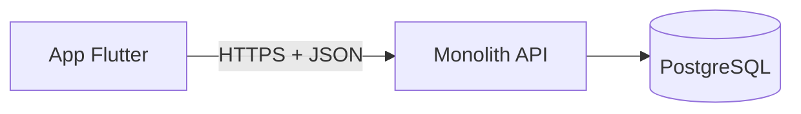
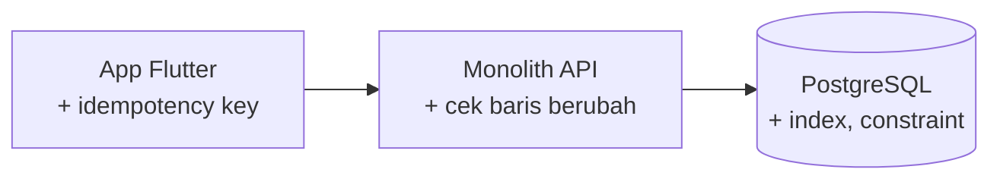
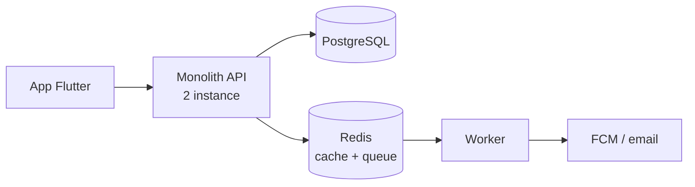
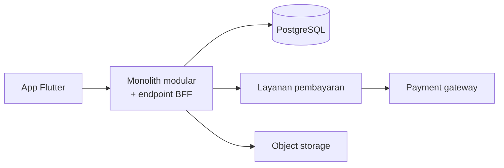
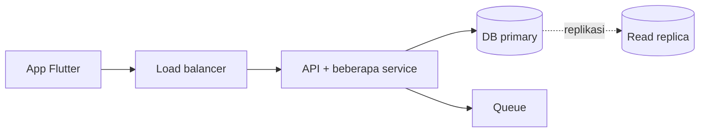
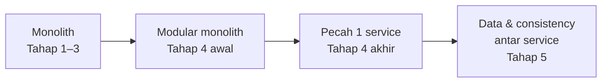
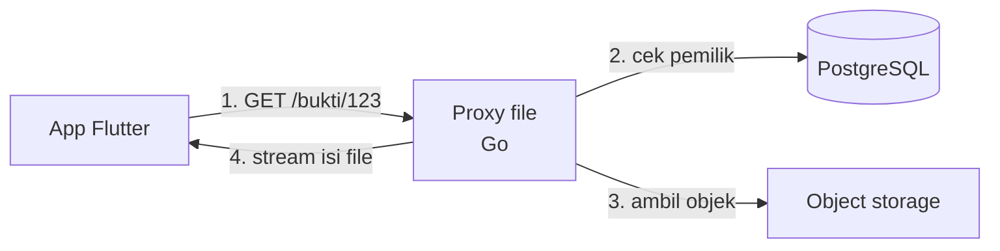
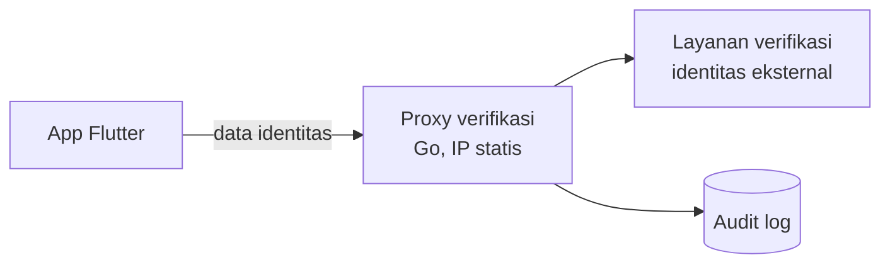

# STORY · Satu cerita yang tumbuh

Dokumen perencanaan cerita.
Tanggal: 2026-10-05

> **GATE A disetujui (2026-10-05) dengan revisi:** nama dicek terhadap produk nyata dan ditandai fiktif; Tahap 3–4 dikerjakan setelah Tahap 1–2 dinilai; navigasi per tahap + indeks per topik sebagai nav kedua; di layar < 44em blok "Kamu di sini" jadi satu baris yang bisa dibuka; revisi a–e diterapkan di dokumen ini.

**Masalah yang dijawab:** B3.1 berdiri sendiri. Kamu tidak tahu sedang berada di mana dalam keseluruhan sistem.
**Jawaban:** satu aplikasi fiktif yang tumbuh dari 100 user sampai jutaan. Setiap konsep muncul karena cerita membutuhkannya, bukan karena ada di daftar materi.

Isi:

0. [Dua keputusan pembuka](#0-dua-keputusan-pembuka)
1. [Aplikasinya: Rekeningo](#1-aplikasinya-rekeningo)
2. [Lima tahap skala](#2-lima-tahap-skala)
3. [Alur arsitektur](#3-alur-arsitektur)
4. [Pemetaan halaman ke tahap](#4-pemetaan-halaman-ke-tahap)
5. [Perubahan template: blok "Kamu di sini"](#5-perubahan-template-blok-kamu-di-sini)
6. [Halaman "Peta cerita"](#6-halaman-peta-cerita)
7. [Contoh integrasi Tahap 4: proxy dan BFF](#7-contoh-integrasi-tahap-4-proxy-dan-bff)
8. [Keputusan GATE A](#8-keputusan-gate-a-2026-10-05)

---

## 0. Dua keputusan pembuka

**Nama: Rekeningo (fiktif).** Nama awal "Kantong" ternyata sudah dipakai aplikasi nyata di kategori keuangan: *Kantong - Catat Pengeluaran* dan *KantongKu - Catatan Keuangan* di Google Play (dicek 2026-10-05). Kandidat lain juga gugur: Kocek (ada e-wallet d-Kocek di Malaysia), Celengin (domain `celengin.com` aktif dipakai aplikasi bernama sama), Pundi, Lumbung, Kasira, Saldora, Bayarta. **Rekeningo** tidak ditemukan di Google Play, App Store (pencarian iTunes), pencarian web, maupun domain `.com`, `.id`, `.co.id`, `.app`. Rekeningo selalu ditulis dengan label "fiktif" di halaman Peta cerita dan A0.

**Penafian untuk A0** (wajib satu kalimat): *Rekeningo dan seluruh ceritanya fiktif; cerita ini tidak mengklaim kepatuhan terhadap regulasi pembayaran, perlindungan data, atau aturan lain yang berlaku di dunia nyata.*

**Domain: dompet digital + pemesanan.** Saya setuju dengan usulanmu, karena alasan berikut.

- Transaction, race condition, idempotency, payment gateway, notifikasi, dan upload muncul alami. Semuanya inti backend.
- Contoh Budi dan Ani di B3.1 dan rekaman lab B3 langsung masuk ke cerita. Pilot tidak perlu dibuang.
- Alternatifnya, pelaporan lapangan offline-first, kuat di sync dan conflict resolution. Tapi lemah di transaction uang, idempotency pembayaran, dan integrasi payment gateway. Topik offline-first tetap masuk lewat aplikasi merchant (Tahap 3) dan studi desain sampingan D4c.

**Tahap 5: masuk cerita, tapi hanya sebagai kerangka.** Rekomendasi saya:

- STORY.md menulis Tahap 5 lengkap di tingkat cerita, asumsi, dan arsitektur. Tanpa itu, "ke mana arahnya" tidak terlihat dari tahap mana pun.
- Halaman konsep yang hanya milik Tahap 5 (D2 bagian sharding, D3, D4b) dibuat **paling akhir** dan boleh ditunda. Cerita Tahap 1–4 tidak bergantung padanya.
- Tahap 5 paling spekulatif. Semua angkanya asumsi, dan beberapa keputusannya bergantung pada vendor cloud. Itu ditandai jelas di bawah.

Catatan: diagram proxy yang kamu sebut (Go di depan object storage dan di depan layanan web eksternal) tidak terlampir di sesi ini. Bagian 7 saya susun dari deskripsimu, dengan nama netral.

---

## 1. Aplikasinya: Rekeningo

**Rekeningo** adalah aplikasi Flutter untuk menyimpan saldo, transfer ke sesama pengguna, dan memesan barang dari toko kecil di sekitar. Toko seperti warung, apotek kecil, atau toko kelontong membuka etalase di Rekeningo. Pembeli membayar dari saldo, toko menyiapkan pesanan, lalu pembeli mengambil atau menerima antaran.

Backend Rekeningo ditulis oleh satu developer, lalu tumbuh bersama penggunanya. Cerita ini netral stack. Contoh kode di setiap halaman ditampilkan dalam beberapa stack yang setara (Go, Node, Laravel, Django, Spring, Supabase/Firebase).

| Tokoh | Peran | Kenapa penting di cerita |
|---|---|---|
| **Budi** | Pengguna. Top-up, transfer, pesan makan siang dari HP. | Sumber hampir semua bug yang terlihat user: dobel bayar, saldo salah, notifikasi terlambat. |
| **Ani** | Pemilik warung, berjualan lewat Rekeningo. | Sisi merchant: stok, pesanan masuk, riwayat penjualan, HP dengan sinyal tidak stabil. |
| **Raka** | Developer. Mobile engineer Flutter yang kini juga memegang backend. | Sudut pandangmu. Setiap keputusan teknis dilihat dari mata Raka. |
| **Sinta** | Pemilik produk. | Membawa tuntutan bisnis: fitur baru, target pertumbuhan, kerja sama dengan pihak ketiga. |

---

## 2. Lima tahap skala

### Cara menghitung asumsi beban (berlaku untuk semua tahap)

Semua angka di tabel asumsi adalah **asumsi cerita**, bukan data nyata. Rumusnya ditulis supaya kamu bisa mengganti angkanya sendiri. Rumus ini juga bahan halaman D1.

```text
DAU               = user terdaftar × rasio aktif harian
request per hari  = DAU × request per user aktif per hari
rata-rata RPS     = request per hari ÷ 86.400 detik
puncak RPS        = rata-rata RPS × faktor puncak
data per tahun    = transaksi per hari × 365 × ukuran per baris
```

Parameter yang dipakai per tahap, semuanya asumsi. Tabel asumsi di tiap tahap memakai angka dari tabel ini.

| Parameter | Tahap 1 | Tahap 2 | Tahap 3 | Tahap 4 | Tahap 5 | Alasan memilih |
|---|---|---|---|---|---|---|
| User terdaftar | 100 | 1.000 | 10.000 | 100.000 | 1.000.000 | Batas atas tiap tahap |
| Rasio aktif harian | 30% | 30% | 25% | 20% | 20% | Turun saat user bertambah, karena makin banyak user pasif |
| Request per user aktif per hari | 40 | 40 | 60 | 60 | 60 | Naik di Tahap 3 karena polling status pesanan dan fitur baru |
| Faktor puncak | 10× | 10× | 10× | 10× | 10× | Trafik menumpuk di jam makan siang dan malam |
| Transaksi per user aktif per hari | 2 | 2 | 2 | 2 | 2 | Satu top-up atau transfer, satu pembayaran pesanan |
| Ukuran per baris transaksi (termasuk index) | ±300 B | ±300 B | ±300 B | ±300 B | ±300 B | Baris berisi id, user, jumlah, status, waktu |
| Upload file per hari | – | – | – | 2.000 | 20.000 | Foto produk dan bukti bayar mulai di Tahap 4 |
| Ukuran rata-rata file | – | – | – | 500 KB | 500 KB | Foto dari HP setelah dikompres |

Pelajaran penting dari angka ini: **puncak RPS di Tahap 1–3 kecil**. Masalah di tahap awal hampir selalu soal kebenaran data dan query yang lambat, bukan kapasitas server. Berapa RPS yang sanggup dilayani satu server tidak ditebak di panduan ini. Itu diukur dengan load test di sistemmu sendiri.

---

### Tahap 1 · 1–100 user · MVP

**Cerita.** Sinta ingin menguji Rekeningo di satu kompleks perkantoran, dan Raka punya enam minggu. Pertanyaan pertama Raka: cukup pakai Supabase atau Firebase, atau perlu backend sendiri? Transfer saldo menuntut dua perubahan yang terjadi bersama, dan aturan bisnisnya tidak boleh dipegang app di HP, jadi Raka memilih satu monolith dengan satu database. Di minggu ketiga, transfer yang gagal di tengah jalan menghilangkan saldo seorang penguji. Dari situ lahir B3.1.

**Asumsi beban.**

| Besaran | Nilai | Cara hitung |
|---|---|---|
| User terdaftar | 100 | asumsi |
| DAU | 30 | 100 × 30% (asumsi) |
| Request per hari | 1.200 | 30 × 40 (asumsi) |
| Puncak RPS | ±0,14 | 1.200 ÷ 86.400 × 10 (asumsi) |
| Data transaksi per tahun | ±6,6 MB | 30 × 2 × 365 × 300 B (asumsi) |
| Tim | 1 developer | asumsi |

**Masalah → konsep → keputusan.**

| Masalah | Konsep | Opsi + trade-off |
|---|---|---|
| Perlu backend sendiri atau tidak? | A4 BaaS vs backend sendiri | BaaS: cepat, tapi logika uang tersebar di rules atau fungsi database. Backend sendiri: lebih lambat dibuat, tapi aturan bisnis ada di satu tempat. |
| Transfer gagal di tengah, saldo hilang | **B3.1 transaction** | Satu transaction per transfer. Biayanya kecil. Tidak ada alasan untuk tidak memakainya. |
| Budi bisa melihat saldo Ani lewat ID di URL | B5.1 authentication, B5.3 authorization (ownership) | Cek kepemilikan di setiap query. Lupa sekali, data bocor. |
| App Flutter dan backend sering beda paham soal bentuk JSON | B1.1, B1.2, B1.4 kontrak API | Kontrak tertulis (OpenAPI) sejak awal, atau dokumentasi informal. Kontrak tertulis lebih lambat di awal, tapi jadi bahan spesifikasi untuk AI (F1). |
| Logika transfer tercampur dengan parsing HTTP | **B7.1 lapisan dasar** (handler, logika bisnis, akses data) | Tiga lapisan sederhana sejak awal. Lebih dari itu (banyak interface, DI framework) berlebihan untuk satu developer. |

**Arsitektur.**



Sebelumnya belum ada apa-apa. Sesudahnya tiga elemen. Itu cukup.

**Sengaja belum dilakukan.**

- Cache, queue, worker: belum ada masalah yang dijawabnya.
- Microservice: satu developer tidak butuh batas antar-tim.
- Load balancer dan multi-instance: downtime beberapa menit saat deploy masih bisa diterima untuk 100 penguji.
- Kubernetes: biaya belajar dan operasionalnya jauh lebih besar dari manfaatnya di tahap ini.

---

### Tahap 2 · 100–1.000 user · Keluhan saldo salah dan dobel bayar

**Cerita.** Rekeningo dibuka untuk tiga kompleks. Budi menarik saldo dari HP dan tablet hampir bersamaan, keduanya sukses, dan saldonya tercatat lebih besar dari seharusnya. Di jam makan siang sinyal kantin lemah, app mengulang request bayar setelah timeout, dan Budi tertagih dua kali. Riwayat penjualan Ani mulai lambat. Penyebabnya bukan jumlah data, tapi satu query per pesanan untuk mengambil item.

**Asumsi beban.**

| Besaran | Nilai | Cara hitung |
|---|---|---|
| User terdaftar | 1.000 | asumsi |
| DAU | 300 | 1.000 × 30% (asumsi) |
| Request per hari | 12.000 | 300 × 40 (asumsi) |
| Puncak RPS | ±1,4 | 12.000 ÷ 86.400 × 10 (asumsi) |
| Data transaksi per tahun | ±66 MB | 300 × 2 × 365 × 300 B (asumsi) |
| Tim | 2 developer | asumsi |

**Masalah → konsep → keputusan.**

| Masalah | Konsep | Opsi + trade-off |
|---|---|---|
| Dua penarikan bersamaan sama-sama lolos | **B3.2 race condition & lock**, B3.3 isolation | `UPDATE` atomik (paling sederhana), `FOR UPDATE` (logika rumit), atau optimistic lock (tanpa menunggu). Detail di B3.2. |
| App retry setelah timeout, user tertagih dua kali | B1.3 idempotency, **E3** idempotency key dari client | Idempotency key per aksi bayar. Butuh tabel penyimpan key dan masa simpannya. |
| Riwayat penjualan lambat | B2.4 N+1, B2.3 index | Perbaiki N+1 dulu (dampaknya terbesar), lalu index sesuai pola query. Index mempercepat baca tapi menambah biaya tulis. |
| Riwayat panjang membebani HP | B1.3 pagination, E5 ukuran payload | Pagination berbasis cursor vs offset. Cursor stabil saat data bertambah, tapi tidak bisa lompat ke halaman ke-N. |
| Perubahan kolom membuat app versi lama crash | **E1** app versi lama, B4.2 ubah skema tanpa downtime | Expand → migrate → contract. Lebih lambat dari "ubah langsung", tapi app lama tetap jalan. |
| Bug race susah dibuktikan | C1 testing | Test yang menjalankan dua request bersamaan, sebagai regression test. |

**Arsitektur.** Bentuknya sama dengan Tahap 1. Yang berubah ada di dalam kotak.



**Sengaja belum dilakukan.**

- Cache untuk riwayat: masalahnya N+1 dan index, bukan kurangnya cache. Cache akan menyembunyikan query yang buruk.
- Pindah ke NoSQL "karena lebih cepat": data uang butuh transaction dan constraint (B2.2).
- Distributed lock (Redis lock): satu database sudah menyediakan lock yang benar.

---

### Tahap 3 · 1.000–10.000 user · Lambat di jam sibuk

**Cerita.** Rekeningo dipakai di satu kota, dan jam 12.00–12.30 app terasa lambat atau timeout. Raka ingin menambah server, tapi belum tahu bagian mana yang lambat. Trace menunjukkan endpoint bayar membuka transaction, lalu memanggil API notifikasi dan email **di dalam transaction itu**, sehingga koneksi database tertahan sekitar 2 detik per request. Request lain menunggu koneksi kosong dari pool. Ani juga mengeluh: perubahan stok yang dibuat saat sinyal hilang ikut hilang.

**Asumsi beban.**

| Besaran | Nilai | Cara hitung |
|---|---|---|
| User terdaftar | 10.000 | asumsi |
| DAU | 2.500 | 10.000 × 25% (asumsi) |
| Request per hari | 150.000 | 2.500 × 60 (asumsi, polling status pesanan menambah request) |
| Puncak RPS | ±17 | 150.000 ÷ 86.400 × 10 (asumsi) |
| Data transaksi per tahun | ±550 MB | 2.500 × 2 × 365 × 300 B (asumsi) |
| Tim | 3–4 developer | asumsi |

Perhatikan: 17 RPS masih kecil. Lambatnya bukan karena volume, tapi karena pekerjaan lambat dijalankan di jalur request **sambil memegang koneksi database**.

**Hitungan: kenapa pool habis.** Little's Law menyatakan L = λ × W: jumlah rata-rata yang sedang "di dalam sistem" sama dengan laju kedatangan dikali lama tinggal ([Little 1961](https://doi.org/10.1287/opre.9.3.383)). Untuk koneksi database, L adalah jumlah koneksi yang sedang dipegang.

| Kondisi | λ (puncak, asumsi) | W (koneksi dipegang, asumsi) | L = koneksi yang dibutuhkan |
|---|---|---|---|
| Notifikasi + email di dalam transaction | 17 request/detik | 2 detik | **±34 koneksi** |
| Notifikasi dipindah ke worker, transaction hanya berisi query | 17 request/detik | 0,02 detik (20 ms) | **±0,34 koneksi** |

Bandingkan dengan ukuran pool bawaan beberapa stack (dicek ke dokumentasi):

| Stack | Ukuran pool bawaan | Sumber |
|---|---|---|
| node-postgres `Pool` | 10 koneksi; `connectionTimeoutMillis` 0 = menunggu tanpa batas | [node-postgres](https://node-postgres.com/apis/pool) |
| HikariCP (Spring Boot) | 10 koneksi; `connectionTimeout` 30 detik | [HikariCP](https://github.com/brettwooldridge/HikariCP) |
| pgxpool (Go) | max(4, jumlah CPU) | [pgxpool](https://pkg.go.dev/github.com/jackc/pgx/v5/pgxpool#Config) |
| Go `database/sql` | **tanpa batas** (`MaxOpenConns` 0), idle 2 | [database/sql](https://pkg.go.dev/database/sql#DB.SetMaxOpenConns) |
| Django | tanpa pool secara default (`CONN_MAX_AGE` 0: koneksi ditutup tiap akhir request); pool psycopg opsional | [Django](https://docs.djangoproject.com/en/stable/ref/databases/) |
| PostgreSQL `max_connections` | biasanya 100 | [PostgreSQL](https://www.postgresql.org/docs/current/runtime-config-connection.html) |

Jadi **17 RPS saja tidak menghabiskan pool**. Dengan transaction yang hanya berisi query (W ±20 ms), pool 10 koneksi masih jauh dari penuh. Yang menghabiskan pool adalah **W yang besar**, yaitu koneksi ditahan selama menunggu API luar. Dengan 34 koneksi dibutuhkan, pool 10 penuh, dan request lain mengantre atau timeout. Di Go `database/sql` tanpa batas, masalahnya pindah ke PostgreSQL: 34 koneksi per instance mendekati `max_connections` begitu ada beberapa instance. Perbaikan yang benar adalah memperkecil W (B10.1, B3.1 "jangan panggil API luar di dalam transaction"), bukan memperbesar pool.

**Masalah → konsep → keputusan.**

| Masalah | Konsep | Opsi + trade-off |
|---|---|---|
| Tidak tahu apa yang lambat | **C2 observability** (log, metric, trace) | Ukur dulu sebelum mengubah apa pun. Butuh biaya alat dan disiplin menulis log. |
| Request menunggu koneksi database | **B2.5 connection pool**, Little's Law (hitungan di atas) | Perbesar pool (beban ke PostgreSQL naik, mendekati `max_connections`) vs perkecil W dengan memindahkan API luar keluar dari transaction (lebih tepat). |
| Notifikasi dan email memperlambat request bayar | **B10.1 background job**, B8 concurrency & async | Pindah ke worker + queue. Request jadi cepat, tapi muncul status "sedang diproses" dan perlu retry serta dead-letter. |
| Status pesanan di-polling tiap 5 detik | E4 push & real-time | FCM untuk "pesanan siap", polling dengan interval panjang sebagai cadangan. WebSocket belum perlu. |
| Halaman katalog toko dibaca ribuan kali dengan isi sama | B9 caching | Cache dengan TTL. Risikonya data stale: harga atau stok yang tampil bisa sudah berubah. |
| Login dicoba ribuan kali dari satu IP | C4 security, rate limit | Rate limit per IP dan per akun. Terlalu ketat bisa memblokir banyak user asli yang berbagi satu IP, mis. satu jaringan Wi-Fi. |
| Stok Ani berubah saat offline lalu hilang | **E2 offline-first & sync** | Antrean perubahan lokal + sync, dengan aturan konflik (stok server menang, atau gabung per item). |
| Deploy membuat app mati beberapa menit | C3 deployment | Dua instance + rolling deploy. Syaratnya aplikasi stateless (tidak menyimpan sesi di memori). |

**Arsitektur.**



Sebelum: App → Monolith → PostgreSQL. Sesudah: enam elemen. Worker masih bagian dari codebase monolith yang sama, hanya dijalankan sebagai proses terpisah.

**Sengaja belum dilakukan.**

- Microservice: masalahnya pekerjaan lambat di jalur request, bukan batas tim. Worker dari codebase yang sama sudah cukup.
- Read replica: database belum menjadi bottleneck menurut metric. Replica menambah masalah consistency (D3).
- Kafka atau message broker besar: Redis atau database sebagai queue sudah cukup untuk volume ini [perlu verifikasi dengan load test saat itu].

---

### Tahap 4 · 10.000–100.000 user · Integrasi pihak ketiga

**Cerita.** Sinta bekerja sama dengan payment gateway untuk top-up, dan gateway itu kadang mengirim webhook yang sama dua kali. Untuk saldo besar, Rekeningo harus memverifikasi identitas lewat layanan pihak ketiga yang hanya menerima IP terdaftar (asumsi cerita, bukan klaim regulasi). Foto produk dan bukti pembayaran mulai menumpuk di server. Tim kini delapan orang, dan dua tim sering bentrok saat deploy monolith yang sama.

**Asumsi beban.**

| Besaran | Nilai | Cara hitung |
|---|---|---|
| User terdaftar | 100.000 | asumsi |
| DAU | 20.000 | 100.000 × 20% (asumsi) |
| Request per hari | 1,2 juta | 20.000 × 60 (asumsi) |
| Puncak RPS | ±140 | 1,2 juta ÷ 86.400 × 10 (asumsi) |
| Data transaksi per tahun | ±4,4 GB | 20.000 × 2 × 365 × 300 B (asumsi) |
| File (foto produk, bukti bayar) per tahun | ±365 GB | 2.000 upload per hari × 500 KB × 365 (asumsi) |
| Tim | 6–10 developer, 2 tim | asumsi |

**Masalah → konsep → keputusan.**

| Masalah | Konsep | Opsi + trade-off |
|---|---|---|
| Payment gateway lambat atau mati, request ikut menggantung | **B11 integrasi pihak ketiga**: timeout, retry, circuit breaker | Timeout ketat + retry dengan backoff + circuit breaker. Butuh status "pending" di UI. |
| Webhook dikirim dua kali | B10.2 webhook, idempotency (B1.3) | Simpan ID event, abaikan duplikat. |
| Saldo sudah ditambah tapi pesan ke layanan lain gagal terkirim | **B10.2 outbox** | Tulis event ke tabel outbox dalam transaction yang sama, lalu kirim oleh worker. Ada delay kecil. |
| Layanan verifikasi identitas hanya menerima IP terdaftar | **Proxy di depan layanan eksternal** (bagian 7) | Satu proxy Go dengan IP statis, credential, timeout, dan audit log. Satu titik yang harus dijaga ketersediaannya. |
| File besar lewat server API | **D4d upload file**, proxy vs signed URL (bagian 7) | Signed URL (beban server kecil, kontrol lebih sedikit) vs proxy (kontrol penuh, bandwidth lewat server). |
| App butuh 5 request untuk satu layar beranda | **BFF** (bagian 7), E5 | Satu endpoint agregasi khusus app mobile. Menambah satu komponen yang harus dirawat. |
| Login dengan akun Google | B5.2 OAuth 2.0 / OIDC | Library resmi + PKCE. Jangan menulis alur OAuth sendiri. |
| Dua tim bentrok di satu codebase | **B7.2 batas modul**, modular monolith, D5 ADR | Modul dengan batas tegas dulu. Pecah satu service kalau batasnya sudah stabil (bagian 3). |
| Deploy salah, harus mundur cepat | C3 CI/CD + rollback | Rollback image + migration yang kompatibel mundur (B4.2). |

**Arsitektur.**



Sebelum: monolith tunggal + worker (Tahap 3). Sesudah: monolith yang dipecah per modul, dan **satu** service yang keluar, yaitu pembayaran. Alasannya ada di bagian 3. Redis, worker, dan proxy identitas tidak digambar supaya tetap ≤ 6 elemen. Proxy identitas punya diagram sendiri di bagian 7.

**Sengaja belum dilakukan.**

- Memecah semua modul jadi service: hanya pembayaran yang punya alasan kuat (bagian 3).
- Service mesh, event bus untuk semua hal: masalahnya belum ada.
- Multi-region: belum ada tuntutan ketersediaan setinggi itu.

---

### Tahap 5 · 100.000–1.000.000+ user · Satu database tidak cukup *(kerangka)*

**Cerita.** Rekeningo dipakai di banyak kota, dan metric menunjukkan database utama penuh oleh query baca. Laporan bulanan merchant membuat transaksi harian ikut melambat. Feed promo dan notifikasi dikirim ke ratusan ribu user sekaligus. Tagihan cloud naik, dan Sinta mulai bertanya soal biaya per transaksi.

**Asumsi beban.**

| Besaran | Nilai | Cara hitung |
|---|---|---|
| User terdaftar | 1.000.000 | asumsi |
| DAU | 200.000 | 1.000.000 × 20% (asumsi) |
| Request per hari | 12 juta | 200.000 × 60 (asumsi) |
| Puncak RPS | ±1.400 | 12 juta ÷ 86.400 × 10 (asumsi) |
| Data transaksi per tahun | ±44 GB | 200.000 × 2 × 365 × 300 B (asumsi) |
| File per tahun | ±3,6 TB | 20.000 upload per hari × 500 KB × 365 (asumsi) |
| Tim | 20+ developer | asumsi |

**Masalah → konsep → keputusan.**

| Masalah | Konsep | Opsi + trade-off |
|---|---|---|
| Database utama penuh oleh query baca | D2 replication (read replica) | Baca dari replica. Muncul replication lag: user bisa tidak melihat transaksinya sendiri sesaat (D3, read-your-writes). |
| Tabel transaksi sangat besar | D2 partitioning | Partisi per bulan memudahkan arsip dan query per periode. Query lintas partisi lebih rumit. |
| Laporan merchant mengganggu transaksi | Pisah beban analitik | Replica khusus laporan, atau data warehouse terpisah. Data laporan tertinggal beberapa menit. |
| Data antar service tidak sinkron | D3 consistency, saga, outbox | Eventual consistency dengan kompensasi. Lebih sulit di-debug dari satu transaction. |
| Notifikasi ke ratusan ribu user | D4b feed & notifikasi, queue | Fan-out lewat queue. Butuh pembatasan laju supaya FCM atau email tidak menolak. |
| Biaya | D1 (biaya sebagai requirement) | Ukur biaya per transaksi. Kadang query yang lebih baik lebih hemat dari server tambahan. |

**Arsitektur.**



**Sengaja belum dilakukan, bahkan di tahap ini.**

- Sharding database: partitioning + replica dicoba dulu. Sharding mengubah hampir semua query dan sulit dibatalkan.
- Menulis ulang ke bahasa lain demi performa: bottleneck jarang ada di bahasa pemrograman.

Semua batas di tahap ini bergantung pada pengukuran sistem sungguhan. Di panduan, Tahap 5 mengajarkan **cara berpikir dan trade-off**, bukan angka kapasitas.

---

## 3. Alur arsitektur



| Perubahan | Kapan masuk akal | Sinyal yang harus terlihat dulu | Kenapa tidak lebih awal |
|---|---|---|---|
| **Monolith** | Sejak awal | – | – |
| **Monolith + worker** (Tahap 3) | Ada pekerjaan lambat di jalur request | Trace menunjukkan request menunggu email, notifikasi, atau API luar | Tanpa pekerjaan lambat, worker hanya menambah komponen |
| **Modular monolith** (Tahap 4 awal) | Dua tim atau lebih di satu codebase | Perubahan satu fitur sering merusak fitur lain. Konflik merge dan deploy sering | Batas modul yang dibuat terlalu awal biasanya salah tempat |
| **Pecah satu service** (Tahap 4 akhir) | Satu modul punya kebutuhan yang jelas berbeda | Pembayaran butuh audit lebih ketat, ritme deploy lebih hati-hati, dan akses ke credential gateway yang tidak boleh dipegang modul lain | Setiap service menambah deploy, monitoring, dan panggilan jaringan yang bisa gagal |
| **Data & consistency antar service** (Tahap 5) | Ada lebih dari satu service yang memegang data | Satu operasi bisnis menyentuh dua database | Selama satu database, satu transaction sudah cukup |

Dasar rule of thumb "monolith dulu": Martin Fowler mengamati bahwa hampir semua cerita microservice yang berhasil dimulai dari monolith yang membesar lalu dipecah. Sebaliknya, sistem yang dibangun sebagai microservice sejak awal hampir selalu bermasalah ([Monolith First](https://martinfowler.com/bliki/MonolithFirst.html), [Microservice Premium](https://martinfowler.com/bliki/MicroservicePremium.html)). Itu pengamatan praktisi, bukan hasil penelitian terkontrol.

Kenapa yang dipecah pertama adalah **pembayaran**, bukan modul lain: credential payment gateway, audit, dan aturan rilisnya berbeda dari fitur katalog atau promo. Notifikasi juga kandidat, tapi di Tahap 3 sudah cukup dipisah sebagai worker.

---

## 4. Pemetaan halaman ke tahap

Tahap = tahap cerita yang **pertama kali** memunculkan konsep itu. Halaman boleh dirujuk lagi di tahap berikutnya.

| Halaman | Tahap | Adegan yang memunculkannya |
|---|---|---|
| A0 Cara pakai | Pembuka | – |
| A1 Apa yang dikerjakan backend | 1 | Raka memutuskan isi backend Rekeningo |
| A2 Perjalanan satu request | 1 | Tap "Transfer" sampai saldo tersimpan |
| A3 Peta komponen | 1 → diperbarui tiap tahap | Diagram arsitektur tiap tahap |
| A4 BaaS vs backend sendiri | 1 | Pertanyaan pertama Raka |
| Istilah inti | 1 | – |
| D1 Kerangka berpikir + estimasi | 1 | Tabel asumsi beban pertama |
| B1.1 HTTP | 1 | Endpoint transfer |
| B1.2 Resource & format error | 1 | App menampilkan pesan error yang jelas |
| B1.3 Pagination, idempotency | 2 | Riwayat panjang, retry bayar |
| B1.4 Kontrak API (OpenAPI) | 1 | App dan backend beda paham soal JSON |
| B2.1 Data modeling | 1 | Skema akun, transaksi, pesanan |
| B2.2 SQL vs NoSQL | 1 (dirujuk lagi di 2) | Pilihan database awal |
| B2.3 Index & query plan | 2 | Riwayat penjualan Ani |
| B2.4 N+1 | 2 | Riwayat penjualan Ani |
| **B3.1 Transaction** | **1** | Transfer gagal di tengah |
| **B3.2 Race condition & lock** | **2** | Budi menarik dari dua perangkat |
| B3.3 Isolation level | 2 | Lanjutan B3.2 |
| B4.1 Migration | 1 | Skema pertama |
| B4.2 Ubah skema tanpa downtime | 2 | App versi lama crash |
| B5.1 Authentication | 1 | Login |
| B5.2 OAuth/OIDC | 4 | Login dengan Google |
| B5.3 Authorization | 1 | Budi melihat saldo Ani lewat ID |
| B6 Validation & error | 1 | Nominal transfer negatif |
| B7.1 Lapisan dasar | 1 | Logika transfer tercampur parsing HTTP |
| B7.2 Batas modul | 4 | Dua tim bentrok, modular monolith |
| B8 Concurrency & async | 3 | Pekerjaan lambat di jalur request |
| B9 Caching | 3 | Katalog toko |
| B10.1 Background job | 3 | Notifikasi dan email |
| B10.2 Webhook & outbox | 4 | Webhook gateway ganda, event antar service |
| B11 Integrasi pihak ketiga | 4 | Payment gateway lambat |
| C1 Testing | 1 (dasar), 2 (regression race) | – |
| C2 Observability | 3 | "Tidak tahu apa yang lambat" |
| C3 Deployment | 1 (dasar), 3 (rolling), 4 (rollback) | – |
| C4 Security dasar | 3 | Brute force login, rate limit |
| D2 Scaling | 5 (stateless sudah dikenalkan di 3) | Database utama penuh |
| D3 Consistency | 5 | Replica lag, data antar service |
| D4a Studi: pembayaran | 4 | Rangkuman Tahap 4 |
| D4b Studi: feed & notifikasi | 5 | Fan-out notifikasi |
| D4c Studi: laporan lapangan offline | **tidak natural** | Lihat di bawah |
| D4d Studi: upload file | 4 | Foto produk, bukti bayar |
| D5 Template ADR | 4 | Keputusan memecah layanan pembayaran |
| E1 App versi lama | 2 | Kolom berubah, app lama crash |
| E2 Offline-first & sync | 3 | Stok Ani hilang saat offline |
| E3 Retry, idempotency key dari client | 2 | Dobel bayar |
| E4 Push & real-time | 3 | Polling status pesanan |
| E5 Ukuran payload | 2 | Riwayat panjang |
| F1 Spesifikasi untuk AI | 1 | Raka meminta AI membuat endpoint transfer |
| F2 Review kode AI | 1 | Review endpoint transfer buatan AI |
| F4 Membaca dokumentasi | **tidak natural** | Lihat di bawah |
| F5 Mencari literatur | **tidak natural** | Lihat di bawah |
| F6 Peta "masalah X → halaman Y" | **tidak natural** | Lihat di bawah |

**Halaman tanpa tempat natural, dan usulannya:**

| Halaman | Usulan | Alasan |
|---|---|---|
| D4c Laporan lapangan offline | **Pertahankan sebagai studi desain sampingan**, dikerjakan setelah Tahap 4. Konsep offline-first sudah masuk cerita lewat E2 (stok Ani). | Domainnya berbeda dari Rekeningo, tapi dekat dengan pekerjaanmu. Memaksakannya ke cerita akan membuat Rekeningo jadi aneh. |
| F4, F5 | **Gabung jadi satu halaman "Belajar mandiri"** di bagian alat, di luar cerita. | Ini keterampilan, bukan konsep sistem. Tidak ada adegan yang membutuhkannya. |
| F6 | **Digantikan Peta cerita** (bagian 6) + indeks "masalah → halaman" di dalamnya. | Kolom "Masalah" di tiap tahap sudah berbentuk peta masalah. |

**Konsep baru yang muncul dari cerita** dan belum ada halamannya di PLAN:

| Konsep | Tahap | Usulan |
|---|---|---|
| Connection pool | 3 | Halaman baru pendek **B2.5 Connection pool** (sebelumnya tidak punya halaman sendiri) |
| Proxy dan BFF di depan sistem luar | 4 | Halaman baru **B11.2 Proxy & BFF**, berisi dua skenario di bagian 7 |
| Halaman tahap (5 buah) | 1–5 | Satu halaman pembuka per tahap: cerita, asumsi, arsitektur sebelum/sesudah, daftar halaman. Menggantikan sebagian besar D4 |

---

## 5. Perubahan template: blok "Kamu di sini"

Blok ini berada **di paling atas**, sebelum judul atau langsung di bawahnya. Tujuannya supaya pembaca tahu posisinya tanpa membuka halaman lain.

```markdown
Kamu di sini · Tahap 2 dari 5 · 100–1.000 user
Rekeningo dibuka untuk tiga kompleks, dan muncul keluhan saldo salah. Budi menarik dari HP
dan tablet bersamaan, dan keduanya sukses.
Sebelumnya (Tahap 1): transfer sudah aman dari kegagalan di tengah jalan berkat transaction.
[Peta cerita]
```

Aturan:

- Tiga baris teks maksimal: posisi tahap, rekap cerita 2 kalimat, satu kalimat tahap sebelumnya.
- Data blok diambil dari satu file (`docs/widgets/data/cerita.json`). Isi yang sama dipakai juga oleh Peta cerita, jadi tidak ada dua sumber yang bisa saling beda.
- Diagram statis di bawah Inti sekarang adalah **arsitektur tahap itu** (≤ 6 elemen), sesuai permintaanmu. Diagram alur langkah (BEGIN → ROLLBACK) pindah ke "Cara kerjanya".

**Layar pertama (keputusan GATE A, opsi 2).**

- Di layar ≥ 44em blok tampil penuh (tiga baris).
- Di layar < 44em blok menjadi **satu baris yang bisa dibuka** ("Kamu di sini · Tahap 2/5 ▸"). Rekap dan tahap sebelumnya muncul saat dibuka.
- Pretest tidak dipindah.
- Aturan "diagram di bawah Inti terlihat utuh tanpa scroll" tetap berlaku di empat viewport.

---

## 6. Halaman "Peta cerita"

Satu halaman yang menampilkan:

1. **Lima kolom tahap** (di HP jadi lima baris): nama tahap, rentang user, satu kalimat masalah utama.
2. **Arsitektur yang berkembang**: diagram kecil per tahap. Elemen baru di tahap itu diberi warna sistem (biru), elemen lama abu-abu. Jadi kamu melihat apa yang ditambahkan, bukan menghafal ulang seluruh diagram.
3. **Daftar halaman per tahap** dengan status:
    - *ada* atau *belum dibuat*: dari `cerita.json`.
    - *selesai dibaca*: dari penanda "Tandai selesai" di localStorage.
    - progress bar per tahap.
4. **Indeks masalah**: "saldo salah", "dobel bayar", "lambat di jam sibuk", dan seterusnya, masing-masing menaut ke halamannya. Ini menggantikan F6.

Diagram tetap statis (HTML + CSS seperti `bb-flow`), tanpa animasi.

---

## 7. Contoh integrasi Tahap 4: proxy dan BFF

Ketiganya sering tertukar, jadi definisikan dulu:

| Istilah | Arti satu kalimat | Contoh di Rekeningo |
|---|---|---|
| **Proxy** | Server perantara yang meneruskan request ke sistem lain, sambil menambahkan hal yang tidak boleh atau tidak bisa dipegang client. | Proxy Go yang memegang credential dan IP terdaftar untuk layanan verifikasi identitas |
| **BFF (Backend for Frontend)** | "Satu backend per user experience", yaitu endpoint yang dibentuk khusus untuk satu jenis client ([Sam Newman](https://samnewman.io/patterns/architectural/bff/)). | Endpoint beranda app Flutter yang menggabungkan saldo, pesanan aktif, dan promo dalam satu response |
| **Gateway offloading** | Memindahkan urusan bersama (TLS, rate limit, auth) ke satu komponen di depan service ([Microsoft](https://learn.microsoft.com/en-us/azure/architecture/patterns/gateway-offloading)). | Rate limit dan validasi token di depan semua endpoint |

### Skenario 1 · Ambil file dari object storage

Budi membuka bukti pembayarannya. File disimpan di object storage (S3 atau sejenisnya), bukan di database. Proxy Go mengambil file dari storage dan meneruskannya ke app, setelah memastikan Budi memang pemiliknya.



| Opsi | Cara kerja | Kelebihan | Biaya |
|---|---|---|---|
| **Proxy Go (stream)**, skenario utama | Proxy mengecek akses di setiap unduhan, lalu meneruskan isi file dari storage | Kontrol penuh: cek akses tiap kali, audit log, akses bisa diputus seketika | Semua byte lewat proxy. Butuh timeout, batas ukuran, dan kapasitas bandwidth sendiri |
| **Signed URL (presigned URL)**, alternatif | Server membuat URL berbatas waktu, app mengunduh langsung dari storage | Bandwidth tidak lewat server | AWS menyebutnya *bearer token*: siapa pun yang memegang URL bisa memakainya berulang kali sampai kedaluwarsa. Masa berlaku 1 menit–12 jam lewat console, sampai 7 hari lewat CLI atau SDK. URL ikut tidak berlaku lebih awal kalau credential pembuatnya dicabut, dihapus, atau dinonaktifkan ([AWS: presigned URL](https://docs.aws.amazon.com/AmazonS3/latest/userguide/using-presigned-url.html), [AWS: berbagi objek](https://docs.aws.amazon.com/AmazonS3/latest/userguide/ShareObjectPreSignedURL.html)) |

Rule of thumb untuk cerita: foto produk publik → signed URL atau CDN. Bukti bayar dan dokumen identitas → proxy, atau signed URL dengan masa berlaku sangat pendek.

### Skenario 2 · Kirim data ke layanan eksternal lewat proxy Go

Untuk saldo di atas batas tertentu, Rekeningo memverifikasi identitas lewat **layanan verifikasi identitas pihak ketiga** (nama netral). Layanan itu hanya menerima request dari IP yang didaftarkan, memakai credential khusus, dan kadang lambat.



App tidak pernah memegang credential layanan eksternal dan tidak perlu tahu alamatnya. Proxy memvalidasi token user Rekeningo lebih dulu sebelum meneruskan apa pun.

Yang dikerjakan proxy, dan kenapa di sana:

| Tugas | Kenapa di proxy |
|---|---|
| Memegang credential dan IP statis | Hanya satu komponen yang perlu didaftarkan dan diamankan |
| Timeout, retry terbatas, circuit breaker ([Fowler](https://martinfowler.com/bliki/CircuitBreaker.html)) | Layanan eksternal yang lambat tidak boleh menahan request lain |
| Menerjemahkan format data | Format eksternal tidak bocor ke seluruh codebase Rekeningo (anti-corruption layer, [Microsoft](https://learn.microsoft.com/en-us/azure/architecture/patterns/anti-corruption-layer)) |
| Audit log tanpa data pribadi mentah | Bisa dilacak tanpa menyimpan NIK atau foto identitas di log |
| Rate limit ke arah layanan eksternal | Kuota dari pihak ketiga tidak habis karena retry |

Trade-off: proxy adalah satu komponen tambahan yang harus selalu hidup. Kalau proxy mati, verifikasi berhenti total. Butuh dua instance dan monitoring sendiri.

Kedua skenario menjadi isi halaman baru **B11.2 Proxy & BFF**, dengan lab yang bisa dijalankan. Lab memakai object storage lokal (mis. MinIO di docker) dan layanan eksternal tiruan [perlu verifikasi pilihan image saat membangun].

---

## 8. Keputusan GATE A (2026-10-05)

1. Domain dompet digital + pemesanan, tokoh Budi/Ani/Raka/Sinta: **setuju**. Nama diganti menjadi **Rekeningo** karena "Kantong" bentrok dengan aplikasi nyata (bagian 0).
2. Tahap 5 ditulis lengkap, halamannya paling akhir. Tahap 3–4 dikerjakan setelah Tahap 1–2 dinilai.
3. Navigasi per tahap, dengan **indeks per topik** (bagian A–G lama) sebagai nav kedua, selain Glosarium dan Kamus Lintas Stack.
4. Gabung/buang di bagian 4 dan 8: setuju.
5. Layar pertama: opsi 2 (bagian 5).

---

## Lampiran · Verifikasi link (2026-10-05)

Semua link di dokumen ini dicek dengan `curl -L`. 14 dari 15 mengembalikan HTTP 200. Pengecualian: `doi.org/10.1287/opre.9.3.383` (Little 1961) mengarah (302) ke situs penerbit INFORMS, yang memasang challenge Cloudflare untuk klien non-browser (`cf-mitigated: challenge`, HTTP 403). Judul, jurnal, tahun, dan penulisnya diverifikasi lewat Crossref API.

Klaim angka yang dicek ke dokumentasi, bukan ingatan: ukuran pool bawaan (node-postgres, HikariCP, pgxpool, Go `database/sql`, Django, PostgreSQL `max_connections`) dan masa berlaku presigned URL AWS (console 1 menit–12 jam, CLI/SDK sampai 7 hari, berakhir lebih awal bila credential pembuatnya dicabut).
